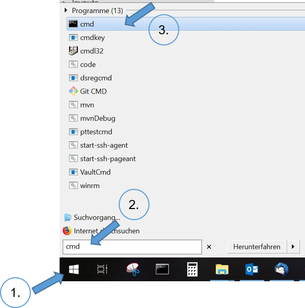
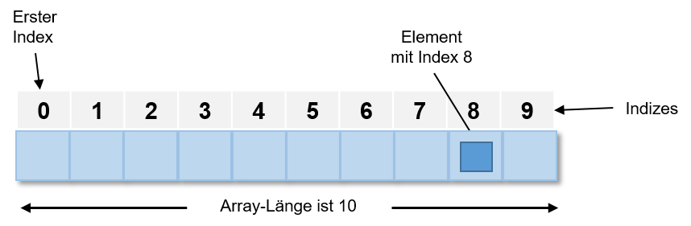

# Informatikwerkstatt
__Java Grundlagen__

Note: Hinweis, dass am nächsten Di Vorlesung ist und keine Übung, da der 31.10 Feiertag ist, somit wäre nächste Woche nur Übung am Fr 2.11

---

## Sprichst Du Java?

* Objektorientierte Programmiersprache, 1995 veröffentlicht
* Plattformunabhängig &rarr; Java Programme laufen auf verschiedenen Betriebssystemen (Windows, Mac, Unix, Android)
* Java Software ist in Oracle's Standard Edition Java Development Kit enthalten [(Java SE JDK)](https://www.oracle.com/technetwork/java/javase/overview/index.html)
* Aktuelle Version: [Java 11](http://jdk.java.net/11/)
* Die Java Software ist auf den Pool-Rechnern installiert

===

## Hello-World: Mein erstes Java-Programm

- Ein [Hello-World-Programm](https://de.wikipedia.org/wiki/Hallo-Welt-Programm) ist ein Minimalbeispiel für ein Programm in einer Programmiersprache
- Das folgende Java-Programm gibt die Zeichenkette ```Hello World``` auf der Konsole aus.

```java
public class CHelloWorld
{
	public static void main( String[] p_args )
	{
		System.out.println( "Hello World" );
	}
}
```

===

## Java Standalone am Rechner
 
- Java Compiler: ```javac```
- Übersetzt (kompiliert) Java Programme in binäres bytecode-Format (Endung ```.class```)
- Java Virtual Machine (JVM): ```java```
    - Laufzeitumgebung für Java
    - JVM für jedes Betriebssystem vorhanden


===

## Java überall

Wir nutzen später in dieser Vorlesung [Java auf Android](/android-grundlagen/)


---

## Quellcode, Binärcode, Apps ...??

- **Quellcode**: Textbasierte Darstellung eines Programms
    - ```java```-Textdatei, erstellt z.B. in [Visual Studio Code](https://code.visualstudio.com/)
   	- Zeichen werden in einer [Kodierung](https://de.wikipedia.org/wiki/Zeichenkodierung) gespeichert (deutsche Umlaute)
    - heute wird meist [UTF-8](https://de.wikipedia.org/wiki/UTF-8) verwendet

- **Binärcode**: Ausführbares Programm, als Bytefolge gespeichert
    - ```class```-Binärdateien sind  für den Menschen nicht lesbar
    - werden von Programmen wie dem Java Compiler ```javac``` erzeugt

- **App**: Ein Programm, das vom Nutzer aufgerufen und verwendet werden kann (z.B. Google Maps)

---

## Kommandozeile - tippen statt clicken!

> Die [Kommandozeile / Windows Eingabeaufforderung](https://de.wikipedia.org/wiki/Kommandozeile) ermöglicht mittels Tastatureingabe Befehle/Programme auszuführen. 

- Manuelles  Kompilieren einfacher Programmbeispiele
- Starten einfacher Beispiele
- Verstehen des Prozesses des Kompilierens und der Ausführung von Javaprogrammen

===

### Kommandozeilentool unter Windows: Eingabeaufforderung

<div class="flex">
<div><ol><li>Linksklick auf Windows-Symbol</li><li>In Windows-Suche ```cmd``` eingeben <kbd>Return</kbd></li><li>Linksklick auf angezeigtes ```cmd```-Symbol</li></ol></div>
<div>

</div>
</div>

===

### Befehle der Eingabeaufforderung

- ```dir``` &rarr; Inhalt des aktuellen Verzeichnisses
- ```[Laufwerk:]``` wechselt auf den entsprechenden Laufwerksbuchstaben z.B. ```C:```
- ```cd [Pfad]``` &rarr; wechselt Laufwerk / Verzeichnis
	- ```cd Development``` &rarr; wechselt in das existiertende Unterverzeichnis ```Development```
    - ```cd \``` &rarr; wechselt ins Wurzelverzeichnis (Laufwerk)
    - ```cd ..``` &rarr; wechselt in das übergeordnete Verzeichnis
- Befehl mit der Option ```/?``` aufrufen, um eine kurze Hilfe zu erhalten
- [Liste weiterer Befehle](https://de.wikibooks.org/wiki/Batch-Programmierung:_Wichtige_DOS-Kommandos)

<small>Für Mac OS X Benutzer gibt es keine Laufwerksbuchstaben und der ```\``` wird durch einen ```/``` ersetzt und man verwendet anstatt ```dir``` den befehl ```ls -l```</small>

===

#### Wo ist der Desktop?

* unter Windows unter ```C:\Users\[Windows Benutzername]\Desktop```
* unter Mac OS X unter ```/Users/[OSX Benutzername]/Desktop``` oder in Kurzform ```~/Desktop```

===
 
### Kompilieren des Quellcodes

- Übersetzen des geschriebenen Java-Quellcodes in _Maschinensprache_ (meistens Binärcode)
- Eingabe in Kommandozeile:

```shell
javac HelloWorld.java
```

<small>Damit der Befehl ```javac``` gefunden wird, müssen zwei Umgebungsvariablen ```JAVA_HOME``` und ```PATH``` gesetzt sein. Im Pool wurden diese schon vollständig [konfiguriert](https://docs.oracle.com/javase/10/install/installation-jdk-and-jre-microsoft-windows-platforms.htm). </small>

===

### Ausführen des Programms

<iframe class="video" src="https://player.vimeo.com/video/287916699" frameborder="0" webkitallowfullscreen mozallowfullscreen allowfullscreen />

```shell
java HelloWorld
```

---

## @Let's try

1. Starte _Visual Studio Code_
2. Erstelle leere Datei mit dem Namen ```CHelloWorld.java```
3. Kopiere oder schreibe den Beispielcode des [Hello-World-Programms](#/1/1) __exakt wie angegeben__ in die Datei
4. Speichere die Datei auf dem Desktop
5. Öffne die _Eingabeaufforderung_
6. Schau mittels ```dir``` wo der Desktop ist
7. Wechsel mit ```cd``` auf den Desktop
8. Kompiliere das Programm
9. Führe das Programm aus

---

## Aufbau eines Java-Programms

- Betrachten wir noch einmal unser [HelloWorld-Programm](#/1/1)
- Quelldatei enthält Klasse ```CHelloWorld```
    - *Achtung*: Groß-/Kleinschreibung wird in Java generell unterschieden!
- Die ```CHelloWorld``` Klasse hat eine [Methode](/oop-grundlagen/#/6) ```main``` zum Starten des Programms 

===

### Klassen 
	
- Zentrale Einheit der [objektorientierten Programmierung](/oop-grundlagen/). 
- Programmcode ist in Klassen organisiert
- Jede Klasse hat einen Namen (z.B. ```CHelloWorld```)
- Konvention: Name der Klasse = Name der Quelldatei, die die Klasse enthält und Prefix ```C``` für Klasse / Class

===

### Methoden

- Strukturieren den Code einer Klasse
- [Methode](/oop-grundlagen/#/8) beschrieben durch
	- Rückgabewert (```void``` = Methode gibt keinen Wert zurück)
	- Name (```main```)
	- Eingabeparameter (optional), beschrieben durch 
		- Typ, z.B. ```String[]``` bezeichnet Liste ([Array](#/14)) von Zeichenketten
		- Name ```p_args``` 
	- Rumpf mit Anweisungen, in ```{ ... }``` eingefasst
- [Methoden](/oop-grundlagen/#/8) und Klassen können außerdem sog. Modifikatoren haben (z.B. ```public```, oder ```public static``` (siehe [Objekt-Orientierte Programmierung Grundlagen](/oop-grundlagen/))

---

## Java Schlüsselwörter

* Java besitzt [50 reservierte Schlüsselwörter](https://en.wikipedia.org/wiki/List_of_Java_keywords), die in der Sprachdefinition festgelegt sind.
* Sie definieren den Grundwortschatz der Programmiersprache, grundlegende Befehle
* Im [HelloWorld-Programm](#/1/1) haben wir bereits einige davon kennen gelernt: ```public```, ```class```, ```static```, ```void```
* Schlüsselwörter dürfen nicht als Variablen-, Funktions-, Methoden-, Klassennamen benutzt werden

---

## Datentypen

- Alle Daten, die in Java-Programmen verarbeitet werden, müssen einen wohldefinierten Datentyp haben
- Jeder Datentyp hat einen Namen und definiert einen Wertebereich
- Java enthält vordefinierte (primitive) Basisdatentypen 

===

### Standard-Datentypen

| Datentyp | Wertebereich | Größe |
|--|--|
| boolean | ```true``` und ```false``` | 1 Byte |
| byte | Ganze Zahlen ($\mathbb{Z}$) von -128 bis 127 | 1 Byte |
| int| Ganze Zahl ($\mathbb{Z}$) | 4 Byte | 
| double| Fliesskommazahl ($\mathbb{R}$) | 8 Byte | 
| char | Einzelne Zeichen z.B. `'a'` | 2 Byte  |
| String| Zeichenkette z.B. `"Hello World!"` | dynamisch, max. $2^{31}-1$ Zeichen |

===

### Aufzählungsdatentyp: enum

* Manche Datentypen erlauben Werte aus einer vordefinierte Menge von Konstanten, z.B. Wochentage, Monate, Kleidergrößen
* Dafür gibt es in Java den Aufzählungstyp ```enum```
* Definition:

```java
public enum Schwierigkeit {
    NIEDRIG, MITTEL, HOCH 
}
```

* Die Werte werden mit Großbuchstaben geschrieben, weil sie Konstanten bedeuten
* Verwendung eines ```enum``` Datentyps:

```java
Schwierigkeit level = Schwierigkeitsgrad.HOCH;
```

* Die Variable ```level``` kann einen der Werte des ```enum``` Typs annehmen

===

### @Profis

Warum  gibt es verschiedene Datentypen für Zahlenwerte?
Man könnte doch für alles `double` verwenden ...

---

## Variablen

> Variablen sind Kartons im Speicher, in die wir etwas rein tun können. Es gibt spezielle Kartons für Schuhe, große Kartons für den TFT Monitor mit Polsterung... Datentypen bestimmen, welche Art des Wertes in die Variable rein kommt

```java    
public class CHelloWorld
{

    public static void main( String[] p_args )
    {
        // Variable wird Methode als Parameter übergeben
        final String l_message = "Hello World";
        System.out.println( l_message );
    }
}
```

===

### Zuweisung

<span class="rrd" data-rrd="Diagram( Optional( Terminal('final'), 'skip'), NonTerminal('Datentyp'),NonTerminal('Variablenname'),Optional(Sequence(Terminal('='),Choice(0,Sequence(Terminal('new'),NonTerminal('Klasse')),NonTerminal('Wert'))), 'skip'),Terminal(';'))"></span>

- _Variablendeklaration_ ist der Teil _vor_ dem ```=```
- _Variablenzuweisung_ ist der Teil _hinter_ dem ```=```
- ```=``` nennt man Zuweisungsoperator, es wird von rechts nach links gelesen, d.h. das was auf der rechten Seite steht, wird in die links stehende Variable geschrieben
- Modifikator ```final``` ermöglicht Variablen nicht _schreibbar_ zu machen, d.h. der Wert ist unveränderbar

===

### Verwendung von Variablen bei Aufrufen

- Die Variable `l_message` wird deklariert und ihr Wert direkt zugewiesen
- Der Wert der Variable wird dann an die [Methode](/oop-grundlagen/#/8) ```println``` übergeben und dort weiterverarbeitet.

```java	
public static void main( String[] p_args )
{
        // Variable wird Methode als Parameter übergeben
        final String l_message = "Hello World";
        System.out.println( l_message );
}
```

=== 

### main-Methode
 
- Programme wie unser [HelloWorld-Beispiel](#/1/1) , die eine ```main```-[Methode](/oop-grundlagen/#/8) haben, sind *ausführbar*.
- Ausführung: Aufruf / Abarbeitung, des Inhaltes von ```main```
- Das Argument ```String[] p_args``` kann genutzt werden, um bei dem Aufruf des Programms über die Kommandozeile Parameter an es zu übergeben.

---

## Typumwandlung

Typumwandlung (engl. *Casting*) ist die Umwandlung eines Datentyps in einen anderen

```java
public class CTypeUmwandlung
{
    public static void main( final String[] p_args )
    {
        final byte l_byte = 1;

        // implizites Casting
        final int l_toint = l_byte;
        final double l_todouble = l_toint;

        System.out.println( "Ausgabe: " + l_byte + "    " + l_toint + "    " + l_todouble );
    }
}
```

===

### @Let's try

1. Erstelle ein Programm aus dem [gezeigtem Code](#/9)
2. Kompiliere das Programm und führe es aus 

&rArr; Was beobachtest Du?

===

### @Let's try

1. Ergänze in das [Programm](#/9) als letzte Zeilen

    ```java
    final String l_text = Integer.toString( l_toint );
    System.out.println( "Textausgabe: " + l_text );
    ```

2. Kompiliere das Programm und führe es aus 

&rArr; Was beobachtest Du? Wie kannst Du es erklären?

&rArr; Versuche, das Programm so umzuschreiben, dass es mit der Variable ```l_todouble``` funktioniert?

---

### Implizites vs. explizites Casting

- *Erweiterndes Casting* (```int``` &rarr; ```double```) &rarr; Compiler führt es automatisch durch (implizites Casting)
- *Einschränkendes Casting* (```double``` &rarr; ```int```) &rarr; muss explizit vom Programmierer gemacht werden
- Bei einem expliziten Casting können [Runtime-Fehler](#/18) auftreten

    ```java
    final double l_pi =  3.14159;
    //explizites casting
    final int l_pi_int = (int) l_pi;
    ```

- *Schlechter Code-Stil*, da ein _expliziter Cast_ immer ein Hinweis auf einen nicht richtig definierten Typ ist, besser ist 
ein generischer Typ

    ```java
    final Number l_pi = 3.14159;
    final int l_pi_int = l_pi.intValue();
    final double l_pi_double = l_pi.doubleValue();
    ```
    
===
    
### @Let's try

Führe den [Code](#/10/2) aus und gib die Werte von `l_pi`, `l_pi_int` und `l_pi_double` aus! Was beobachtest Du?

Note: für "l_pi_int" kein Compiler-Fehler, aber nur ganzzahliger Anteil!

---

## Größer, Kleiner, Gleich - Vergleiche und Operatoren

- In Java kann man eine größe Anzahl von [Standard-Operatoren](https://de.wikibooks.org/wiki/Java_Standard:_Operatoren) nutzen
- Einen kennen wir schon: Operator ```A=B``` weist ```A``` den Wert in ```B``` zu 
- Mit arithmetischen Operatoren (z.B. ```+```, ```-```) kann man rechnen. Übersicht [hier](https://de.wikibooks.org/wiki/Java_Standard:_Operatoren#Arithmetische_Operatoren)
- Vergleichs-Operatoren (z.B. ```>```, ```!=```, ```>=```) drücken Bedingungen für Verzweigungen eines Programms aus. Übersicht [hier](https://de.wikibooks.org/wiki/Java_Standard:_Operatoren#Operatoren_f%C3%BCr_Vergleiche)
- Übliche mathematische Präzedenzregeln für Operatoren (z.B. "Punktrechnung vor Strichrechnung"). Übersicht [hier](https://de.wikibooks.org/wiki/Java_Standard:_Operatoren)
- Im Zweifelsfall: Klammern setzen!

===

### @Let's try

```java
int i = 2;
int j = 2 * i;
int k = 4 * ( i + j) / 2;
int l = 4 * i + j / 2;
System.out.println("k = " + k);
System.out.println("l = " + l);
```
    
===

### Test auf Gleichheit

- Vorsicht beim Test auf Gleichheit bei Objekten
- Operator `==` prüft Gleichheit der Speicherstellen

    ```java
    int  i=1;
    int  j=1;
    // Ergebnis: true
    System.out.println( i == j );
    ```

- bei String und anderen Objekten: Test mit [Methode](/oop-grundlagen/#/8) `equals()`

    ```java
    // neues String-Objekt wird erzeugt
    String s1 = new String("maus");
    String s2 = new String("maus");

    // false
    System.out.println( s1 == s2 );
    // true
    System.out.println( s1.equals( s2 ) ); 
    ```

&rArr; Kannst Du dieses Ergebnis erklären?

Note: In ```s1.equals(s2)``` muss ```s1``` initialisiert sein &rarr; prüfen mit ```Objects.nonNull(s1)```

---

## Bedingte Anweisungen - if-else

<span class="rrd" data-rrd="Diagram( Sequence( Terminal('if'), NonTerminal('( Bedingung )'), NonTerminal('{ ... }'), Optional( Sequence( Terminal('else'), NonTerminal('{ ... }') ) ) ) )"</span>

- Blöcke mit mehreren Anweisungen in geschweifte Klammern einfassen!
- Wenn Bedingung erfüllt ist, wird Anweisungsblock ausgeführt; sonst übersprungen.

    ```java
    int a = 2;
    if ( a > 0 ) 
        System.out.println( a + " ist positiv" );

    if ( a <= 0 ) 
        System.out.println(a + "ist nichtpositiv");
    ```

- Entweder-Oder
    
    ```java
    if ( a > 0 ) 
        System.out.println(a + " ist positiv");
    else 
        System.out.println(a + "ist nichtpositiv");
    ```

===

### Ternärer Operator - if-else Kurzform

<span class="rrd" data-rrd="Diagram( Sequence( NonTerminal('Bedingung'), Terminal('?'), NonTerminal('Wert bei True'), Terminal(':'), NonTerminal('Wert bei False') ) )"></span>

- Als Zuweisung 

    ```java
    String l_result = (a > 0) ? "Wert ist positiv" : "Wert ist nicht positiv";
    ```

- Oder etwas eleganter als Parameter

    ```java
    System.out.println(a + " ist " + ((a > 0) ? "positiv" : "nichtpositiv"));
    ```

===

## @Let's try

1. Erstellt eine Klasse ```Example1``` (Datei ```Example1.java```) mit einer ```main```-Methode.
2. Probiert die obigen Beispiele für ```if-else``` und den ternären Operator aus!

===

### @Profis

1. Macht Euch mit der ```switch-case``` Anweisung vertraut, siehe [Link](https://docs.oracle.com/javase/tutorial/java/nutsandbolts/switch.html)!
2. Schreibt ein selbstgewähltes Beispielprogramm, das ```switch-case``` nutzt!

---

## @Home / Übung

Betrachte die beiden folgenden ```if-else``` Anweisungen

1. Überlege, welcher Teil der Anweisungen ausgeführt wird u. warum 
2. Schreibe für jede Anweisung ein Java-Programm; wähle geeignete Ausgaben, um die Ausführung nachvollziehen zu können.

```java
// Anweisung 1				
int a = 5;
int b = 6;	
if ( a < b )
{ 
    a = b; 
}			
else
{
    b = a;
}
```

```java
// Anweisung 2
int a = 5;
int b = 6;
int c = 7;
if (a > b )
{
   a = b;
}
else
{
	if ( a < c ) 
    { 
        a = c; 
    }
}
```
    
Note: Anweisung 1: 5<6, also wird a=b ausgeführt (if-Zweig) Anweisung 2: a <= b, deshalb zunächst else-Zweig, dann wg a < c der if-Zweig

---

## Arrays

- Container mit fester Anzahl von Werten (Details [hier](https://docs.oracle.com/javase/tutorial/java/nutsandbolts/arrays.html))
- alle Elemente sind vom [gleichen Typ](#/7)
- Arrays können in andere Arrays verschachtelt werden
- Elemente über eine Index-Variable beginnend bei 0 bis _Anzahl Elemente - 1_
- Beispiel aus [HelloWorld](#/1/1):  ```String[] p_args```



===

### Array anlegen / initialisieren

- Eindimensionaler Array &rarr; Aufzählung in geschweiften Klammern

    ```java
int[] l_highscores = {1000, 850, 600};
    ```

- Eindimensionaler Array &rarr; leeren Array erzeugen und einzeln mit Werten füllen

    ```java
int[] l_highscores = new int[10];
l_highscores[0] = 471;   ```

- Mehrdimensionaler Array &rarr; leerer Array mit ```new``` und zwei Größen erzeugt

     ```java
// Namenstabelle mit 10 Zeilen, 15 Spalten
String[][] l_tabelle = new String[10][15];
l_tabelle[7][8] = "Steffi";
    ```

===

### Zugriff auf Array mit ```new```

- Adressieren des gesuchten Feldes mit Indexvariable

```java
int[] l_highscores = {1000, 850, 600};

// Variable erhält den Wert aus dem ersten Element 1000
final int l_erstes = l_highscores[0];
```

- Arrayelemente durchlaufen (iterieren) mit `for`-Schleife

```java
for ( int i = 0; i < l_highscores.length; i++ )
    System.out.println(l_highscores[i]); 
```

- Häufiger Fehler: Ungültiger Wert für Index &rarr; führt zu Laufzeitfehler

```java
final int[] highscores = {1000, 850, 600};
//Zugriff auf viertes Element, das nicht existiert
final int l_wert = highscores[3]; 
``` 

===

### Collections

- Datenstrukturen (hier [Collections](https://docs.oracle.com/javase/tutorial/collections/index.html)), als Java Bibliothek, werden zur Speicherung von Daten verwendet
- Beispiel Liste: Klasse ```java.util.ArrayList``` &rarr; dynamischer Array (keine feste Länge)

```java
// importiere die Klasse
import java.util.ArrayList; 

public class CMeineListe
{
    public static void main( final String[] p_args )
    {
        // erzeuge neue Liste
        final ArrayList<String> l_betreuer  =  new  ArrayList<>();

        // füge Elemente ein
        l_betreuer.add( "Phil" );
        l_betreuer.add( "Steffi");
        l_betreuer.add( "Jörg" );

        // gib alle Elemente aus (for-Schleife s.u.)
        for ( final String l_name : l_betreuer)
            System.out.println( l_name );
    }
}
```

===

### @Let's try
 Schreibe zunächst ein kleines Programm, in dem Du 

1. einen ```Array``` deiner Wahl deklarierst,
2. ihn initialisierst,
3. seine Werte ausliest und ausgibst 

===
    
### @Profis

Schreibe ein weiteres Programm, in dem Du 

1. eine ```ArrayList``` deiner Wahl deklarierst
2. sie mit Werten füllst
3. und  ihre Werte ausliest und ausgibst 

---

## Spiel's noch einmal, Sam ... - Schleifen

<!-- for, while und do-while Schleifen, wann benutzt man was anhand eines einfachen zu erklärenden Beispiels -->
- Mit Schleifen könnt Ihr eine Codesequenz mehrfach ausführen
- Z.B. alle Elemente einer Liste ausgeben
- Schleifen haben eine Abbruchbedingung (z.B. Ende der Liste erreicht)
- Es gibt auch [Endlosschleifen](#/16).
- Java bietet unterschiedliche Kontrollstrukturen für Schleifen, z.B.
	- ```for``` (etwas veraltet)
	- ```for each``` 
	- ```while```
	- ```do while``` (erzwingt mindestens einen Durchlauf) 

===

### For each

- die ```for each```-Schleife haben wir im obigen ```ArrayList```-Beispiel schon kennengelernt
- Sie dient zum einfachen Durchlaufen listenartiger Datenstrukturen und Arrays
- Anm.: Das Wort "each" kommt darin nicht vor. Man nennt sie so, um sie von der ```for```-Schleife zu unterscheiden

```java
final ArrayList<String> someList = new ArrayList<>();
// füge "Äpfel", "Birnen", "Pflaumen" zu someList hinzu
for ( final String item : someList )
    System.out.println(item);
```

<small>Da im Rumpf der `for each` Anweisung nur Kopien der Listenelemente verarbeitet werden, kann man damit keine Elemente der Liste ändern oder löschen!</small>

===

### While / Do-While

- Wenn die Anzahl der Wiederholungen eines Codeblocks nicht vorab bekannt ist, sondern nach jedem Durchlauf eine Bedingung überprüft werden muss, nutzen wir die `while-`Schleife
- z.B. wir schauen so lange alle 5 Sekunden in den Briefkasten, bis ein Brief drinnen liegt

```
// Pseudocode - dient nur zum Erklären des Prinzips
// Zum Speichern der Mail
Mail m = null{ // Mache weiter, solange noch keine Mail da ist
        
while ( Objects.isNull(m) )
{
    // Schaue nach Mail
    m = Mailbox.lookup(); 
    // Warte 5 Sekunden
    Thread.sleep(5000); 
}    
// Endlich!! Wir können unsere Mail lesen
m.read();
```

- Und hier noch ein Beispiel für `do-while`

```java
int count = 1;
// der Rumpf der Schleife wird bei do-while mindestens einmal ausgeführt
do
{ 
    System.out.println( "Count is: " + count );
    count++;
}
while ( count < 11 ); 
```

---

## Infinity Loop

Wie kann man ein Programm erzeugen, das nie anhält?
&rarr; Antwort: Whileschleife, die nie abbricht<sup>1</sup>

```java
while ( true )
{
    // einatmen  ... ausatmen
}
```
     
- Es gibt Fälle, in denen Endlosschleifen beabsichtigt sind.
- Manchmal entstehen sie aber unbeabsichtigt - durch Programmierfehler

<small>1: Das lernt man noch einmal in der _Informatik 3 - theoretische Informatik_ bei dem Thema [Halteproblem](https://de.wikipedia.org/wiki/Halteproblem)</small>

===

### Oh weh, was macht mein Programm??
 
```java
public class Endless
{
    public static void  main( String[] p_args )
    {
        int n = 0;
        int m = 0;
        while ( n < 11 )
        {
           System.out.println("Count is: "  + n);
           m++;
        }
    }
}
    ```
     
- Endlosschleifen sind ein einfaches Rezept <i class="em em-astonished"></i>, die CPU komplett auszulasten
- Wenn Ihr das Programm über die Eingabeaufforderung gestartet habt, könnt Ihr es dort mit der Tastenkombination <kbd>Strg</kbd>+<kbd>C</kbd> beenden.
- Manchmal ist es aber nicht so einfach ...

===

### Kill it - Der Task-Manager

Wenn ein Programm "hängt", ist es manchmal unvermeidbar, den Prozess zu beenden, in dem das Programm läuft

1. Rechtsklick auf Datumsanzeige in Windows-Taskleiste
2. Im Menu Task-Manager auswählen
3. "Hängenden" Prozess (hier: Windows-Befehlsprozessor) suchen
4. Rechtsklick  darauf, "Task beenden" auswählen
5. Fertig!

===

### Just Kill-it now

<iframe class="video" src="https://player.vimeo.com/video/288322168" frameborder="0" webkitallowfullscreen mozallowfullscreen allowfullscreen />

---

## @Let's try

- Versuche, die obigen Beispiele selbst zum Laufen zu bringen. 
	- for each, 
	- while / do while
	- Endlosschleife und Folgenbeseitigung

---

### @Profis - Lambda-Expression & Streaming-API

- Wer sich gerade langweilt, weil alles viel zu einfach ist:
- Macht Euch selbst mit zwei fortgeschritteneren Konzepten für die effiziente (und parallele) Verarbeitung großer Datenstrukturen / Datenmengen in Java vertraut.
	- [Lambda-Ausdrücke](https://docs.oracle.com/javase/tutorial/java/javaOO/lambdaexpressions.html)
	- [Java Streaming](https://www.oracle.com/technetwork/articles/java/ma14-java-se-8-streams-2177646.html)
- Quellen zum "Reinschnuppern":
	- [Erste Schritte](https://blog.codecentric.de/2013/10/java-8-erste-schritte-mit-lambdas-und-streams/)
	- [java 8 streams](https://www.baeldung.com/java-8-streams)
	- [Stream tutorial](https://winterbe.com/posts/2014/07/31/java8-stream-tutorial-examples/)

---

## Fehler - Exception

- Fehler in Programmen, z.B.
	- Division durch 0
	- Zugriff auf einen nicht existierenden Array-Index
	- Zugriff auf ein noch nicht erzeugtes Objekt
- Diese Fehler werden in Java als _Exception_ (Ausnahme) bezeichnet 
- Sie treten zur Laufzeit ein (deshalb: [RuntimeException](https://docs.oracle.com/javase/10/docs/api/index.html?java/lang/RuntimeException.html))
- Unbehandelt führen sie zu  Abstürzen oder unerwünschten Programmzuständen 
- In Java werden Ausnahmen von der JVM oder von Java-Programmen "geworfen" (throw) 

===

### @Let's try: Ein Beispiel

Lasst das folgende Beispiel laufen - was passiert?

```java
public class Div0Fehler
{
    public  static  void  main( String[] p_args )
    {
        int  zaehler = 5;
        int  nenner = 0;
        int  ergebnis  = zaehler / nenner;
        System.out.println("Ergebnis: "  + ergebnis);
    }
}
```

===

### Fang den Fehler - try-catch

- Java verwendet das sogenannte _Try-Catch Modell_ zur Ausnahmebehandlung
- Code, in dem eine Ausnahme auftreten kann, wird in einen _Catch_-Block eingeschlossen.
- Dahinter wird ein _Try_-Block angegeben, der bestimmt, was im Falle des Auftretens von Ausnahmen zu tun ist.
- Wir erweitern den Rumpf der ```main```-Methode unserer `Div0Fehler`-Klasse
    
    ```java
      int  ergebnis = 0;
      try{ //
        int  zaehler = 5;
        int  nenner = 0;
        ergebnis = zaehler / nenner;
      } 
      catch (ArithmeticException  e)
      { 
        // try-Block wird beendet!
        System.out.println(e.toString());
        System.out.println("Sorry, Du hast durch null geteilt! Probiere es nochmal!");
      }
      System.out.println("Ergebnis: "  + ergebnis);
    ```

- So kann der Programmierer sinnvoll auf Ausnahmen reagieren 

===

### @Profis: Diskussion

- Ist es sinnvoll, auf Laufzeitfehler wie z.B. Division durch Null mit try-catch zu reagieren?
- Wie könnte man den Fall sinnvoll abfangen, in dem der Nenner von einem Benutzer eingegeben wird?

Note: 1. Frage: eher sinnvoll für nutzerdefinierte DomänenExceptions, die mögliche aber inkorrekte Situationen (wie z.B. NutzerId unbekannt bei einer Registrierung) abbilden. -- 2. Frage Sicherstellen, dass das Programm korrekt aufgerufen wird: vor der Ausführung Eingabetypen prüfen

---

## Stil ist alles

- Damit Programme für andere lesbar sind, gibt es eine Reihe von Regeln und Konventionen bezüglich der Namensgebung und Groß-Klein-Schreibung
- In Java sind sie in sogenannten Coding Style Guides zusammengefasst
- Beispiel: [Google Java Coding Style](https://google.github.io/styleguide/javaguide.html)
- Nachfolgend listen wir ein paar ausgewählte Konventionen auf

===

### Konventionen zur Namensgebung 

- Bei Variablennamen ist Groß-/Kleinschreibung relevant: 
	- ```text``` und ```Text``` sind unterschiedliche Variablen
- Variablen dürfen nur Zahlen, Buchstaben, oder \_ enthalten
- Konstanten i.d.R. in Großbuchstaben, Teilworte mit \_ getrennt, z.B. ```final String APP_NAME = “Meine App“;```
- Konventionen
	- Variablen- und Methodennamen beginnen mit Kleinbuchstaben, z.B. ```liste```, ```main``` <!-- $, \_ bei Variablen hab ich hier weggelassen, zuviel Detail -->
	- Klassennamen beginnen mit Großbuchstaben
	- Besteht ein Name aus mehreren Worten, werden die Anfangsbuchstaben der inneren Worte  groß geschrieben (= CamelCase), z.B.
	- Variable: ```highScoreListe```
	- Methode: ```onCreate()```
	- Klasse: ```ArrayIndexOutOfBoundsException```

---

## @Home / Übung

Im Abschnitt über Arrays haben wir das Problem kennengelernt, dass mit ungültigen (zu großen oder negativen) Array-Indizes auf Elemente eines Arrays zugegriffen wird

1. Schreibt ein Programm, in dem eine solche Situation auftritt
2. Wie heisst die Exception, die hier "geworfen" wird?
3. Überlegt, wie die Situation behandelt werden kann
4. Erstellt einen entsprechenden Try-Catch-Block
5. Kompiliert das Programm und lasst es laufen

---

## @Home / Übung

Schreibt ein Programm, das zwei Argumente von der Kommandozeile einliest, einen String und eine Zahl, und das den String so oft auf der Kommandozeile ausgibt, wie die Zahl angibt.

- Prüft die Typen der Eingaben
- Bei einem leeren String sollte eine Fehlermeldung ausgegeben werden, dass der String leer ist
- Wenn die Zahl $\leq 0$ ist, dann soll eine passende Fehlermeldung ausgegeben werden
* Wenn die Argumentanzahl nicht stimmt, soll auch eine passende Meldung ausgegeben werden
* Wenn bei der Umwandlung des Textes in eine Zahl ein Fehler auftritt, dann soll auch eine verständliche Fehlermeldung ausgegeben werden

---

## @Home / Übung

Schreibt ein Programm, dass zwei ganze Zahlen A und B von der Kommandozeile einliest und (1) das Ergebnis der ganzzahligen Division der beiden Zahlen sowie (2) den Rest der ganzzahligen Division ausgibt.

* Prüft Typen und Anzahl der Eingaben (insbesondere Anforderung:  *ganze* Zahl!)
* Gebt eine entsprechende Fehlermeldungen aus

---

## @Home (optional)

Installation der Java Entwicklungstools auf Eurem Privatrechner (falls verfügbar)

1. Installation [Java Development Kit](https://www.oracle.com/technetwork/java/javase/downloads/index.html)
2. [Setzen der Umgebungsvariablen](https://www.java.com/de/download/help/path.xml) ```JAVA_HOME``` und ```PATH```
3. Installation [Visual Studio Code](https://code.visualstudio.com/)
4. Versucht, ein Java-Programm mit Visual Studio Code zu kompilieren und auszuführen