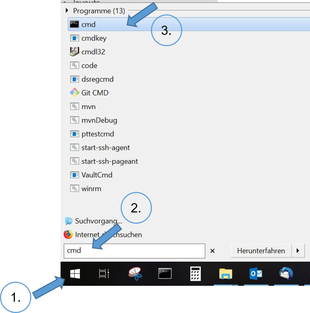

# Informatikwerkstatt
__Java Grundlagen__

---

## Sprichst Du Java?

* Objektorientierte Programmiersprache seit 1995
* Plattformunabhängig &rarr; Java Programme laufen auf verschiedenen Betriebssystemen (Windows, Mac, Unix, Android)
* Java Software enthalten in Oracle's Standard Edition Java Development Kit [(Java SE JDK)](https://www.oracle.com/technetwork/java/javase/overview/index.html)
* Aktuelle Version: [Java 11](http://jdk.java.net/11/)
* Die Java Software ist auf den Pool-Rechnern installiert

===

## Hello-World: Mein erstes Java-Programm

- Ein [Hello-World-Programm](https://de.wikipedia.org/wiki/Hallo-Welt-Programm) ist ein Minimalbeispiel für ein Programm in einer Programmiersprache
- Das folgende Java-Programm gibt die Zeichenkette ```Hello World``` auf der Konsole aus.

```java
public class CHelloWorld
{
	public static void main( String[] p_args )
	{
		System.out.println( "Hello, World" );
	}
}
```

===

## Java Standalone am Rechner
 
- Java Compiler: ```javac```
- Übersetzt Java Programm in binäres bytecode-Format (Endung ```.class```)
- Java Virtual Machine (JVM): ```java```
    - Laufzeitumgebung für Java
    - JVM für jedes Betriebssystem vorhanden


===

## Java überall

Wir nutzen später in dieser Vorlesung [Java auf Ant](/android-grundlagen/)


---

## Quellcode, Binärcode, Apps ...??
 <!-- Übersetzungsvorgang, compilieren + Bundling 
 @Phil: Gehört Bundling nicht eher ins Android Kapitel?-->

- **Quellcode**: Textbasierte Darstellung eines Programms
    - ```.java``` Textdatei, erstellt z.B. [Visual Studio Code](https://code.visualstudio.com/)
   	- Zeichen werd in einer [Kodierung](https://de.wikipedia.org/wiki/Zeichenkodierung) gespeichert (deutsche Umlaute)
    - heute wird meist [UTF-8](https://de.wikipedia.org/wiki/UTF-8) verwendet

- **Binärcode**: Ausführbares Programm als Bytefolge gespeichert, 
    - ```.class``` Binärdateien sind nicht für den Menschen lesbar
    - werden von Programmen wie dem Java Compiler ```javac``` erzeugt

- **App**: Ein Programm, das vom Nutzer aufgerufen und verwendet werden kann (z.B. Google Maps)

---

## Kommandozeile - tippen statt clicken!

> Die [Kommandozeile / Windows Eingabeaufforderung](https://de.wikipedia.org/wiki/Kommandozeile) ist eine Anwendung, um mittels Tastatureingabe Befehle/Programme auszuführen. 

- Manuelles  Compilieren einfacher Programmbeispiele
- Starten einfacher Beispiele
- Verstehen des Prozesses des Compilierens und der Ausführung von Javaprogrammen

===

### Kommandozeilentool unter Windows: Eingabeaufforderung

<div class="flex">
<div>
* Linksclick auf Windows-Symbol
* In Windows-Suche ```cmd``` eingeben (+ Return-Taste)
* Linksclick auf angezeigtes ```cmd```-Symbol
</div>
<div>

</div>
</div>

===

### Befehle der Eingabeaufforderung

- ```dir``` &rarr; Inhalt des aktuellen Verzeichnisses
- ```cd [Laufwerk:][Pfad]``` &rarr; wechselt Laufwerk / Verzeichnis
	- ```cd c:\Programme```
	- ```cd Development``` &rarr; wechselt in das existiertende Unterverzeichnis ```Development```
    - ```cd \``` &rarr; wechselt ins Wurzelverzeichnis
    - ```cd ..``` &rarr; wechselt in das übergeordnete Verzeichnis
- Befehl mit der Option ```/?``` aufrufen, um eine kurze Hilfe zu erhalten
- [Liste weiterer Befehle](https://de.wikibooks.org/wiki/Batch-Programmierung:_Wichtige_DOS-Kommandos)

===
 
### Compilieren des Quellcodes

- Übersetzen des geschriebenen Java-Quellcodes in _Maschinensprache_ (meistens Binärcode)
- Eingabe in Java:

```shell
javac HelloWorld.java
```

- Damit die Datei ```javac.exe``` gefunden wird, müssen die Umgebungsvariablen ```%JAVA_HOME%``` und ```%PATH%``` entsprehend gesetzt sein. Details für Windows [hier](https://docs.oracle.com/javase/10/install/installation-jdk-and-jre-microsoft-windows-platforms.htm).

===

### Ausführen des Programms

<iframe class="video" src="https://player.vimeo.com/video/287916699" frameborder="0" webkitallowfullscreen mozallowfullscreen allowfullscreen />

```shell
java HelloWorld
```

---

## @Let's try

1. Starte _Visual Studio Code_
2. Erstelle leere Datei mit dem Namen ```CHelloWorld.java```
3. Kopiere oder schreibe den Beispielcode des [Hello-World-Programms](#/1/1) __exakt wie angegeben,__ in die Datei
4. Speichere die Datei auf dem Desktop
5. Öffne die _Eingabeaufforderung_
6. Schau mittels ```dir``` wo der Desktop ist
7. Wechsel mit ```cd``` auf den Desktop
8. Compiliere das Programm
9. Führe das Programm aus

---

## Aufbau eines Java-Programms

- Betrachten wir noch einmal unser [HelloWorld-Programm](#/1/1)
- Quelldatei enthält Klasse ```CHelloWorld```
    - *Achtung*: Groß-/Kleinschreibung wird in Java generell unterschieden!
- Die ```CHelloWorld``` Klasse hat eine [Methode](/oop-grundlagen/#/6) ```main``` zum Starten des Programms 

===

### Klassen 
	
- Zentrale Einheit der [objektorientierten Programmierung](/oop-grundlagen/). 
- Programmcode ist in Klassen organisiert
- Klasse hat Namen (z.B. ```CHelloWorld```)
- Konvention: Name der Klasse = Name der Quelldatei, die die Klasse enthält und Prefix ```C``` für Klasse / Class

===

### Methoden

- Strukturieren den Code einer Klasse
- Methode beschrieben durch
	- Rückgabewert (```void``` = Methode gibt keinen Wert zurück)
	- Name (```main```)
	- Eingabeparameter (optional), beschrieben durch 
		- Typ, z.B. ```String[]``` bezeichnet Liste (Array)  von Zeichenketten
		- Name ```p_args``` 
	- Rumpf mit Anweisungen, in ```{ ... }``` eingefasst
- Methoden und Klassen können außerdem sog. Modifikatoren haben (z.B. ```public```, oder ```public static``` (siehe [Objekt-Orientierte Programmierung Grundlagen](/oop-grundlagen/))

---

## Java Schlüsselwörter

* Java besitzt [50 reservierte Schlüsselwörter](https://en.wikipedia.org/wiki/List_of_Java_keywords), die in der Sprachdefinition festgelegt sind.
* Sie definieren den Grundwortschatz der Programmiersprache, grundlegende Befehle
* Im [HelloWorld-Programm](#/1/1) haben wir bereits einige davon kennen gelernt: ```public```, ```class```, ```static```, ```void```
* Schlüsselwörter dürfen nicht als Variablen-, Funktions-, Methoden-, Klassennamen benutzt werden

---

## Datentypen

- Alle Daten, die in Java-Programmen verarbeitet werden, müssen einen wohldefinierten Datentyp haben
- jeder Datentyp hat einen Namen und definiert einen Wertebereich
- Java enthält vordefinierte (primitive) Basisdatentypen 

===

### Standard-Datentypen

|Datentyp|Wertebereich|
|--|--|
| boolean | ```true``` und ```false```, 1 Byte Länge |
| byte | Ganze Zahlen von -128 bis 127 |
| int| Ganze Zahl, 32 bit Länge | 
| double| Fliesskommazahl mit doppelter Genauigkeit | 
| char | Einzelne Zeichen, 16-bit Länge. z.B. `'a'` |
| String| Zeichenkette, max. $2^{31}-1$ Zeichen. z.B. `"Hello World!"` |

===

### @Profis

Warum  gibt es verschiedene Datentypen für Zahlenwerte?
Man könnte doch für alles `double` verwenden ...

---

## Variablen
 
- Benannter Bereich im Speicher, dem in einem Programm ein Wert zugewiesen werden kann 
- Mithilfe der Datentypen können wir dem Java-Compiler genau beschreiben, welches erlaubte Werte einer Variable sind 
- Wir erweitern unser [HelloWorld-Programm](#/1/1):

```java    
public class CHelloWorld
{
    // Variablendeklaration mit Initialisierung
    private static final String message = "Hello World";

    public static void main( String[] p_args )
    {
        // Variable wird Methode als Parameter übergeben
        System.out.println( message );
    }
}
```

===

### Zuweisung

- Variable muss vor Verwendung deklariert werden
    
    ```java
    private static final String message = "Hello World";
    ```

- ```=``` Zuweisungsoperator &rarr; Wert wird einer Variablen zugewiesen
- ```=``` kopiert Wert auf der rechten Seite in die Variable auf der linken 
- Modifikator ```final``` ermöglicht Variablen nicht _schreibbar_ zu mache, d.h. der Wert ist unveränderbar

===

### Verwendung von Variablen bei Methodenaufrufen

- Die Variable `message` kann nach ihrer Instanziierung als Argument (Parameter) beim Aufruf der Methode  `println()` des Objekts `System.out` (siehe [Objekt-Orientierte Programmierung Grundlagen](/oop-grundlagen/)) verwendet werden
- Der Wert der Variable wird an die Methode übergeben und dort weiterverarbeitet. 

```java	
public static void main( String[] p_args )
{
    System.out.println( message );
}
```

=== 

### main-Methode
 
- Programme wie unser [HelloWorld-Beispiel](#/1/1) , die eine ```main```-Methode haben, sind *ausführbar*.
- Ausführung: Aufruf / Abarbeitung der ```main```-Methode
- Das Argument ```java String[] p_args``` der ```main``` Methode kann genutzt werden, um bei dem Aufruf des Programms über die Kommandozeile Parameter an es zu übergeben.

---

## Typumwandlung

Typumwandlung (engl. *Casting*) ist die Umwandlung eines Datentyps in einen anderen

```java
public class CTypeUmwandlung
{
    public static void main( final String[] p_args )
    {
        final byte l_byte = 1;

        // implizites Casting
        final int l_toint = l_byte;
        final double l_todouble = l_toint;

        System.out.println( "Ausgabe: " + l_byte + "    " + l_toint + "    " + l_todouble );
    }
}
```

===

### @Let's try

1. Erstelle ein Programm aus dem [gezeigtem Code](#/9)
2. Übersetze das Programm und führe es aus 

&rArr; Was beobachtest Du?

===

### @Let's try

1. Ergänze in das [Programm](#/9) als letzte Zeilen

    ```java
    final String l_text = Integer.toString( l_toint );
    System.out.println( "Textausgabe: " + l_text );
    ```

2. Übersetze das Programm und führe es aus 

&rArr; Was beobachtest Du und wie kannst Du das erklären?

&rArr; Kannst Du das Programm so umformulieren, dass es mit der Variable ```l_todouble``` funktioniert?

---

### Implizites vs. explizites Casting

- *Erweiterndes Casting* (```int``` &rarr; ```double```) &rarr; Compiler führt es automatisch durch (implizites Casting)
- *Einschränkendes Casting* (```double``` &rarr; ```int```) &rarr; muss explizit vom Programmierer gemacht werden
- Bei einem expliziten Casting können [Runtime-Fehler](#/18) auftreten

    ```java
    final double l_pi =  3.14159;
    //explizites casting
    final int l_pi_int = (int) l_pi;
    ```

- *Schlechter Code-Stil*, da ein _expliziter Cast_ immer ein Hinweis auf einen nicht richtig definierten Typ ist, besser ein generischer Typ

    ```java
    final Number l_pi = 3.14159;
    final int l_pi_int = l_pi.intValue();
    final double l_pi_double = doubleValue();
    ```
    
===
    
### @Let's try

Führe den [Code](#/10/2) aus und gib die Werte von `myInt` und `pi` aus! Was beobachtest Du?

Notes: kein Compile-Fehler, aber nur ganzzahliger Anteil!

---

## Größer, Kleiner, Gleich - Vergleiche und Operatoren

- In Java kann man eine größe Anzahl von [Standard-Operatoren](https://de.wikibooks.org/wiki/Java_Standard:_Operatoren) nutzen
- Einen kennen wir schon: Operator ```A=B``` weist ```A``` den Wert in ```B``` zu 
- Mit arithmetischen Operatoren (z.B. ```+```, ```-```) kann man rechnen. Übersicht [hier](https://de.wikibooks.org/wiki/Java_Standard:_Operatoren#Arithmetische_Operatoren)
- Vergleichs-Operatoren (z.B. ```>```, ```!=```, ```>=```) drücken Bedingungen für Verzweigungen eines Programms aus. Übersicht [hier](https://de.wikibooks.org/wiki/Java_Standard:_Operatoren#Operatoren_f%C3%BCr_Vergleiche)
- Übliche mathematische Präzedenzregeln für Operatoren (z.B. "Punktrechnung vor Strichrechnung"). Übersicht [hier](https://de.wikibooks.org/wiki/Java_Standard:_Operatoren)
- Im Zweifelsfall: Klammern setzen!

===

### @Let's try

```java
int i = 2;
int j = 2 * i;
int k = 4 * ( i + j) / 2;
int l = 4 * i + j / 2;
System.out.println("k = " + k);
System.out.println("l = " + l);
```
    
===

### Test auf Gleichheit

- Vorsicht beim Test auf Gleichheit bei Objekten
- Operator `==` prüft Gleichheit der Speicherstellen

    ```java
    int  i=1;
    int  j=1;
    // Ergebnis: true
    System.out.println( i == j );
    ```

- bei String und anderen Objekten: Test mit Methode `equals()`

    ```java
    // neues String-Objekt wird erzeugt
    String s1 = new String("maus");
    String s2 = new String("maus");

    // false
    System.out.println( s1 == s2 );
    // true
    System.out.println( s1.equals( s2 ) ); 
    ```

&rArr; Könnt Ihr dieses Ergebnis erklären?

Notes: In ```s1.equals(s2)``` muss ```s1``` initialisiert sein &rarr; prüfen mit ```Objects.nonNull(s1)```

---

## Bedingte Anweisungen - if-else

<span class="rrd" data-rrd="Diagram( Sequence( Terminal('if'), NonTerminal('( Bedingung )'), NonTerminal('{ ... }'), Optional( Sequence( Terminal('else'), NonTerminal('{ ... }') ) ) ) )"</span>

- Blöcke mit mehreren Anweisungen in geschweifte Klammern einfassen!
- Wenn Bedingung erfüllt ist , wird Anweisungsblock ausgeführt; sonst übersprungen.

    ```java
    int a = 2;
    if ( a > 0 ) 
        System.out.println( a + " ist positiv" );

    if ( a <= 0 ) 
        System.out.println(a + ist "nichtpositiv");
    ```

- Entweder-Oder
    
    ```java
    if ( a > 0 ) 
        System.out.println(a + " ist positiv");
    else 
        System.out.println(a + ist "nichtpositiv");
    ```

===

### Ternärer Operator - if-else Kurzform

<span class="rrd" data-rrd="Diagram( Sequence( NonTerminal('Bedingung'), Terminal('?'), NonTerminal('Wert bei True'), Terminal(':'), NonTerminal('Wert bei False') ) )"></span>

- als Zuweisung 

    ```java
    String l_result = (a > 0) ? "Wert ist positiv") : "Wert ist nicht positiv";
    ```

- Oder etwas eleganter als Parameter

    ```java
    System.out.println(a + " ist " + ((a > 0) ? "positiv" : "nichtpositiv"));
    ```

===

## @Let's try

1. Erstellt eine Klasse ```Example1``` (Datei ```Example1.java```) mit einer ```main```-Methode.
2. Probier die obigen Beispiele für ```if-else``` und den ternären Operator aus!

===

### @Profi

Switch-case

---

## @Home

Betrachte die beiden folgenden ```if-else``` Anweisungen

1. Überlege, welcher Teil der Anweisungen jeweils ausgeführt wird und warum. 
2. Schreibe für jede Anweisung ein Java-Programm; wähle geeignete Ausgaben, um die Ausführung nachvollziehen zu können.

```java
// Anweisung 1				
int a = 5;
int b = 6;	
if ( a < b )
{ 
    a = b; 
}			
else
{
    b = a;
}
```

```java
// Anweisung 2
int a = 5;
int b = 6;
int c = 7;
if (a > b )
{
   a = b;
}
else
{
	if ( a < c ) 
    { 
        a = c; 
    }
}
```
    
Notes: Anweisung 1: 5<6, also wird a=b ausgeführt (if-Zweig) Anweisung 2: a <= b, deshalb zunächst else-Zweig, dann wg a < c der if-Zweig

---

## Arrays

- Container mit fester Anzahl von Werten ([Details](https://docs.oracle.com/javase/tutorial/java/nutsandbolts/arrays.html))
- alle Elemente sind vom [gleichen Typ](#/7)
- Arrays können in Arrays verschachtelt werden
- Elemente über eine Index-Variable beginnent bei 0 bis _Anzahl Element - 1_
- Beispiel aus [HelloWorld](#/1/1):  ```String[] p_args```


===

### Array anlegen / initialisieren

- Eindimensionaler Array &rarr; Aufzählung in geschweiften Klammern

    ```java
int[] l_highscores = {1000, 850, 600};
    ```

- Eindimensionaler Array &rarr; leeres Arrayerzeugen und einzeln mit Werten füllen r

    ```java
int[] l_highscores = new int[10];
l_highscores[0] = 471    ```

- Mehrdimensionale Arrays &rarr; leeres Array mit ```new``` und zwei Größen erzeug

     ```java
// Namenstabelle mit 10 Zeilen, 15 Spalten
String[][] l_tabelle = new String[10][15];
l_tabelle[7][8] = "Steffi";
    ```

===

### Zugriff auf Array mit ```new```

- Adressieren des gesuchten Feldes mit Indexvariable:

```java
int[] l_highscores = {1000, 850, 600};

// Variable erhält den Wert aus dem ersten ELement 1000
final int l_erstes = l_highscores[0];
```

- Arrayelemente durchlaufen (iterieren) mit `for`-Schleife

```java
for ( int i = =0; i < <highscores.length; i++ )
    System.out.println(highscores[i]); 
```

- Häufiger Fehler: Ungültiger Wert für Index &rarr; führt zu Laufzeitfehler

```java
final    int[] highscores = {1000, 850, 600};
//Zugriff auf viertes Element was nicht existiert
final int l_wert = highscores[3]; 
``` 

===

### Collections

<!-- Packages haben wir noch nicht eingeführt ... -->
<!-- was ist es, kurz fassen und auf Listen & Sets beschränken -->

- Datenstrukturen (hier [Collections](https://docs.oracle.com/javase/tutorial/collections/index.html)), als Java Bibliothek, werden zur Speicherung von Daten verwendet
- Beispiel Liste: Klasse ```java.util.ArrayList``` &rarr; dynamischer Array (keine feste Länge)

```java
// importiere die Klasse
import java.util.ArrayList; 

public class CMeineListe
{
    public static void main( final String[] p_args )
    {
        // erzeuge neue Liste
        final ArrayList<String> l_betreuer  =  new  ArrayList<>();

        // füge Elemente ein
        betreuer.add( "Phil" );
        betreuer.add( "Steffi" s2);
        betreuer.add( "Jörg" );

        // gib alle Elemente aus (for-Schleife s.u.)
        for ( final String l_name : betreuer)
            System.out.println( l_name );
    }
}
```

===

### @Let's try
 Schreibe zunächst ein kleines Programm, in dem Du 

1. einen ```Array``` Deiner Wahl deklarierst
2. ihn initialisierst
3. seine Werte ausliest und ausgibst 

===
    
### @Profis

Schreibe ein weiteres Programm, in dem Du 

1. eine ```ArrayList``` Deiner Wahl deklarierst
2. sie mit Werten füllst
3. und danach die Werte ausliest und ausgibst 

---

## Spiel's noch einmal, Sam ... - Schleifen

<!-- for, while und do-while Schleifen, wann benutzt man was anhand eines einfachen zu erklärenden Beispiels -->
- Mit Schleifen könnt Ihr eine Codesequenz mehrfach ausführen
- Z.B. alle Elemente einer Liste ausgeben
- Schleifen haben eine Abbruchbedingung (z.B. Ende der Liste erreicht)
- Es gibt auch Endlosschleifen (s.u.).
- Java bietet unterschiedliche Kontrollstrukturen für Schleifen, z.B.
	- ```for``` (etwas veraltet)
	- ```for each``` 
	- ```while```
	- ```do while``` (erzwingt mindestens einen Durchlauf) 
- Wir erläutern kurz ```foreach``` und ```while```

===

### For each

<!-- was ist for-each, wann ist es sinnvoll -->
- die ```for each```-Schleife haben wir im obigen ```ArrayList```-Beispiel schon kennengelernt
- Sie dient zum einfachen Durchlaufen listenartiger Datenstrukturen und Arrays
- Anm.: Das Wort "each" kommt darin nicht vor. Man nennt sie so, um sie von der ```for```-Schleife zu unterscheiden

```java
final List<String> someList = new ArrayList<>();
// füge "Äpfel", "Birnen", "Pflaumen" zu someList hinzu
for ( final String item : someList )
    System.out.println(item);
```

- Anm.:  Da im Rumpf der `for each` Anweisung nur Kopien der Listenelemente verarbeitet werden, kann man damit keine Elemente der Liste ändern oder löschen!

===

### While / Do-While

- Wenn die Anzahl der Wiederholungen eines Codeblocks nicht bekannt ist, sondern nach jedem Durchlauf eine Bedingung überprüft werden muss, nutzen wir die `while-`Schleife
- z.B. wir schauen alle 5 Sekunden so lange in den Briefkasten, bis ein Brief drinnen liegt

```
// Pseudocode - dient nur zum Erklären des Prinzips
// Zum Speichern der Mail
Mail m = null{ // Mache weiter, solange noch keine Mail da ist
        
while ( Objects.isNull(m) )
{
    // Schaue nach Mail
    m = Mailbox.lookup(); 
    // Warte 5 Sekunden
    Thread.sleep(5000); 
}    
// Endlich!! Wir können unsere Mail lesen
m.read();
```

- Und hier noch ein Beispiel für `do-while`

```java
int count = 1;
// der Rumpf der Schleife wird bei do-while mindestens einmal ausgeführt
do
{ 
    System.out.println( "Count is: " + count );
    count++;
}
while ( count < 11 ); 
```

---

## Infinity Loop

- Frage: Wie kann man ein Programm erzeugen, das nie anhält?
- Antwort: Whileschleife, die nie abbricht

```java
while ( true )
{
    // einatmen  ... ausatmen
}
```
     
- Es gibt Fälle, in denen Endlosschleifen beabsichtigt sind.
- Manchmal entstehen sie aber unbeabsichtigt - durch Programmierfehler

===

### Oh weh, was macht mein Programm??

- Was passiert hier? 
 
    ```java
public class Endless
{
    public static void  main( String[] p_args )
    {
        int n = 0;
        int m = 0;
        while ( n < 11 )
        {
           System.out.println("Count is: "  + n);
           m++;
        }
    }
}
    ```
     
- Endlosschleifen sind ein einfaches Rezept, die CPU komplett auszulasten :o
- Wenn Ihr das Programm über die Eingabeaufforderung gestartet habt, könnt Ihr es dort mit der Tastenkombination STRG+C beenden.
- Manchmal ist es aber nicht so einfach ...

===

### Kill it - Der Task-Manager
<!-- wie killt man ein hängendes Java Programm -->
- Wenn ein Programm "hängt", ist es manchmal unvermeidbar, den Prozess zu beenden, in dem das Programm läuft
- Dazu
	- Rechtsklick auf Datumsanzeige in Windows-Taskleiste
	- Im Menu Task-Manager auswählen
	- "Hängenden" Prozess (hier: Windows-Befehlsprozessor) suchen
	- Rechtsklick  darauf, "Task beenden" auswählen
	- Fertig!

===

### Just Kill-it now

<iframe src="https://player.vimeo.com/video/288322168" width="320" height="180" frameborder="0" webkitallowfullscreen mozallowfullscreen allowfullscreen></iframe>

---

## @Let's try

- Versuche, die obigen Beispiele selbst zum Laufen zu bringen. 
	- for each, 
	- while / do while
	- Endlosschleife und Folgenbeseitigung

---

### @Profis - Lambda-Expression & Streaming-API

- Wer sich gerade langweilt, weil alles viel zu einfach ist:
- Macht Euch selbst mit zwei fortgeschritteneren Konzepten für die effiziente (und parallele) Verarbeitung großer Datenstrukturen / Datenmengen in Java vertraut.
	- [Lambda-Ausdrücke](https://docs.oracle.com/javase/tutorial/java/javaOO/lambdaexpressions.html)
	- [Java Streaming](https://www.oracle.com/technetwork/articles/java/ma14-java-se-8-streams-2177646.html)
- Quellen zum "Reinschnuppern":
	- [Erste Schritte](https://blog.codecentric.de/2013/10/java-8-erste-schritte-mit-lambdas-und-streams/)
	- [java 8 streams](https://www.baeldung.com/java-8-streams)
	- [Stream tutorial](https://winterbe.com/posts/2014/07/31/java8-stream-tutorial-examples/)

---

## Fehler - Exception
<!-- Was sind Exception, Beispiel am besten Division durch 0 -->

- Fehler in Programmen, z.B.
	- Division durch 0
	- Zugriff auf einen nicht existierenden Array-Index
	- Zugriff auf ein noch nicht erzeugtes Objekt
- Diese Fehler werden in Java als _Exception_ (Ausnahme) bezeichnet 
- Sie treten zur Laufzeit ein (deshalb: RuntimeException)
- Unbehandelt führen sie zu  Abstürzen oder unerwünschten Programmzuständen 
- In Java werden Ausnahmen von der JVM oder von Java-Programmen "geworfen" (throw) 

===

### @Let's try: Ein Beispiel

Lasst das folgende Beispiel laufen - was passiert?

```java
public class Div0Fehler
{
    public  static  void  main( String[] p_args )
    {
        int  zaehler=5;
        int  nenner=0;
        int  ergebnis  = zaehler / nenner;
        System.out.println("Ergebnis: "  + ergebnis);
    }
}
```

===

### Fang den Fehler - try-catch

<!-- wie behandelt man Exceptions -->
- Java verwendet das sogenannte Try-Catch Modell zur Ausnahmebehandlung
- Code, in dem eine Ausnahme auftreten kann, wird in einen "Catch-Block" eingeschlossen.
- Dahinter wird ein Try-Block angegeben, der bestimmt, was im Falle des Auftretens von Ausnahmen zu tun ist.
- Wir erweitern den Rumpf der ```main```-Methode unserer `Div0Fehler`-Klasse
    
    ```java
      int  ergebnis=0;
      try{ //
        int  zaehler=5;
        int  nenner=0;
        ergebnis = zaehler / nenner;
      } 
      catch (ArithmeticException  e)
      { 
        // try-Block wird beendet!
        System.out.println(e.toString());
        System.out.println("Sorry, Du hast durch null geteilt! Probiere es nochmal!");
      }
      System.out.println("Ergebnis: "  + ergebnis);
    ```

- So kann der Programmierer sinnvoll auf Ausnahmen reagieren 

===

### @Profis: Diskussion

- Ist es sinnvoll, auf Laufzeitfehler wie z.B. Division durch Null mit try-catch zu reagieren?
<!-- eher sinnvoll für nutzerdefinierte DomänenExceptions, die mögliche aber inkorrekte Situationen (wie z.B. NutzerId unbekannt bei einer Registrierung) abbilden. -->
- Wie könnte man sinnvoll den Fall abfangen, wenn der Nenner von einem Benutzer eingegeben wird?
<!-- Sicherstellen, dass das Programm korrekt aufgerufen wird: vor der Ausführung Eingabetypen prüfen -->

---

## @Home

1. Installation [Java Development Kit](https://www.oracle.com/technetwork/java/javase/downloads/index.html)
2. [Setzen der Umgebungsvariablen](https://www.java.com/de/download/help/path.xml) ```JAVA_HOME``` und ```PATH```
3. Installation [Visual Studio Code](https://code.visualstudio.com/)

---

## @Home/Übung

- Im Abschnitt über Arrays haben wir das Problem kennengelernt, dass mit ungültigen (zu großen oder negativen) Array-Indizes auf Elemente eines Arrays zugegriffen wird
 1. Schreibt ein Programm, in dem eine solche Situation auftritt
 2. Wie heisst die Exception, die hier "geworfen" wird?
 3. Überlegt, wie die Situation behandelt werden kann
 4. Erstellen einen entsprechenden Try-Catch-Block
 5. Compiliert das Programm und lassen es laufen

---

## @Home/Übung

> Schreiben ein Programm, das zwei Argumente von der Kommandozeile einliest, einen String und eine Zahl, und das den String so oft auf der Kommandozeile ausgibt, wie die Zahl angibt.

- Prüft die Typen der Eingaben
- Bei einem leeren String sollte eine Fehlermeldung ausgegeben werden, dass der String leer ist
- Wenn die Zahl $\leq 0$ ist, dann soll eine passende Fehlermeldung ausgegeben werden
* Wenn die Argumentanzahl nicht stimmt, soll auch eine passende Meldung ausgegeben werden
* Wenn bei der Umwandlung des Textes in eine Zahl ein Fehler auftritt, dann soll auch eine verständliche Fehlermeldung ausgegeben werden

---

## @Home/Übung

> Schreibt ein Programm, dass zwei ganze Zahlen A und B von der Kommandozeile einliest und (1) das Ergebnis der ganzzahligen Division der beiden Zahlen sowie (2) den Rest der ganzzahligen Division ausgibt.

* Prüft Typen und Anzahl der Eingaben (insbesondere Anforderung:  *ganze* Zahl! )
* Gebt eine entsprechende Fehlermeldungen aus

---

## Stil ist alles

- Damit Programme für andere lesbar sind, gibt es eine Reihe von Regeln und Konventionen bezüglich der Namensgebung und Groß-Klein-Schreibung
- In Java sind die in sogenannten Coding Style Guides zusammengefasst
- Beispiel: [Google Java Coding Style](https://google.github.io/styleguide/javaguide.html)
- In der Folge listen wir ein paar ausgewählte dieser Konventionen 

===

### Konventionen zur Namensgebung 

- Bei Variablennamen ist Groß-/Kleinschreibung relevant: 
	- ```text``` und ```Text``` sind unterschiedliche Variable
- Variablen dürfen nur Zahlen, Buchstaben, oder \_ enthalten
- Konstanten i.d.R.  in Großbuchstaben, Teilworte mit \_ getrennt, z.B. ```final String APP_NAME = “Meine App“;```
- Konventionen
	- Variablen- und Methodennamen beginnen mit Kleinbuchstaben, z.B. ```liste```, ```main``` <!-- $, \_ bei Variablen hab ich hier weggelassen, zuviel Detail -->
	- Klassennamen beginnen mit Großbuchstaben
	- Besteht ein Name aus mehreren Worten, werden die Anfangsbuchstaben der inneren Worte  groß geschrieben (= CamelCase), z.B.
	- Variable: ```highScoreListe```
	- Methode: ```onCreate()```
	- Klasse: ```ArrayIndexOutOfBoundsException``
