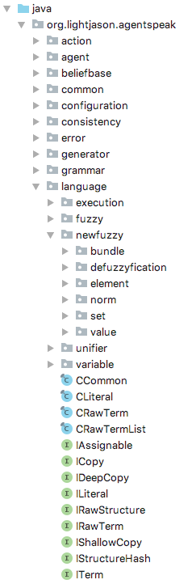

# Informatikwerkstatt
__Grundlagen Objekt-Orientierter Programmierung__

---

## Objekt-Orientierte Programmierung (OOP) - was ist das?

* Beschreibung von Software durch Objekte (seit den 1990ern)
    * Zustand (z.B. Auto hat Farbe, Marke, aktuelle Geschwindigkeit, Gang)
    * Verhalten (z.B. Gang wechseln, Gas geben, bremsen) 
* Prinzip **Abstraktion**:
    * Fokus auf das Wichtige &rarr; was tut ein Objekt?
    * Verbergen des Unwichtigen (wie?) &rarr; [Interfaces](#/3/15)
* Prinzip **Kapselung**:
    * "Zusammenbinden" von Zustand (Daten) und Verhalten (Funktionen / [Methoden](/java-grundlagen/#/5/2))
* Prinzip **Vererbung**
    * Abbilden von Ähnlichkeiten und Unterschieden zwischen Objekten

---

## Klasse & Objekt

* _Klasse_: (abstrakter) Bauplan einer Art von Objekten
  * definiert alle Eigenschaften / Variablen möglicher konkreter Objekte
  * definiert die Funktion / [Methoden](/java-grundlagen/#/5/2) des Objektes
* _Objekt_: aus der Klasse erzeugter Speicherblock im Rechner
    * mit konkreten Belegungen der Variablen
    * wir haben in einer Variablen eine Referenz auf ein Objekt und können damit arbeiten

&rArr; Softwaretechnisch: Klasse erlaubt uns, konkrete Objekte aus ihr zu erzeugen

===

### Beispiel: Klasse, die ein Auto beschreibt

Eigenschaften beschreibenzusammen den Zustand eines Autos &rarr; sie können unveränderbar (```final```) oder veränderbar sein

```java
public class CAuto {
  // --- definiere Eigenschaften ---

  // unveränderbare Eigenschaft durch final  
  private final String m_farbe;
  private final String m_marke;
  private final int m_maxGeschwindigkeit;
  private final int m_anzahlGaenge;

  // veränderbare Eigenschaften
  // aktuelle Geschwindigkeit - der Wert bei Java mit 0 automatisch belegt
  private int m_aktGeschwindigkeit;
  // aktueller Gang - hier wird ein Wert vorgegeben
  private int m_gang = 1;
  
  // --- definiere Methoden ---

  // Default-Konstruktor ohne Parameter
  public CAuto()
  {
    // ruft den Konstruktor mit Parametern auf
    this( "rot", "VW", 5, 250 );
  }

  // Konstruktor mit Parametern
  public CAuto( final String p_farbe, final String p_marke, final int p_anzahlGaenge, final int p_maxGeschwindigkeit)
  {
    m_farbe = p_farbe;
    m_marke = p_marke;
    m_anzahlGaenge = p_anzahlGaenge;
    m_maxGeschwindigkeit = p_maxGeschwindigkeit;
  }
}
```

---

## Instanziierung - Erzeugen eines konkreten Autoobjektes

> Instanziierung &rarr; Erzeugung eines Objekts (Instanz) im Speicher aus einer Klasse

1. Allokation des Speichers<sup>1</sup> für ein Objekt mit dem ```new```-Operator
2. ```new``` liefert eine Referenz auf die Speicherstelle, die in einer Variablen abgelegt wird
    ```java
    final CAuto l_auto = new CAuto("rot", "beetle", 5, 250);
    ```
3. Beim Aufruf von ```new``` wird eine spezielle Methode aufgerufen: der [Konstruktor](/#/5) 

<small>1: Wieviel Speicher benötigt wird, ist durch die Struktur der Klasse festgelegt</small>

---

## Eigenschaften

<span class="rrd" data-rrd="Diagram(Optional( Choice(0, Terminal('public'), Terminal('protected'), Terminal('private')), 'skip'),Optional( Terminal('static'), 'skip'), Optional( Terminal('final'), 'skip'), NonTerminal('Datentyp'),NonTerminal('Eigenschaft- / Variablenname'),Optional(Sequence(Terminal('='),Choice(0,Sequence(Terminal('new'),NonTerminal('Klasse')),NonTerminal('Wert'))), 'skip'),Terminal(';'))"></span>

> Eigenschaften / Properties sind Variablen innerhalb einer Klasse, die für jedes Objekt vorhanden sind und für das Objekt gesetzt werden können. Sie beschreiben den Zustand des Objektes

---

## Konstruktor

* Konstruktoren sind eine spezielle Struktur innerhalb einer Klassendefinition
* Ähneln einer Methode, haben aber den Namen der Klasse und keinen Rückgabewert 

```java
// Default Konstruktor - ohne Parameter
public CAuto()
{
  // ruft den Konstruktor mit mehreren Parametern auf
  this( "rot", "VW", 5, 250 );
}

// überladener Konstruktor - hat mehrere Parameter
public CAuto( final String p_farbe, final String p_marke, final int p_anzahlGaenge, final int p_maxGeschwindigkeit)
{
  m_farbe = p_farbe;
  m_marke = p_marke;
  m_anzahlGaenge = p_anzahlGaenge;
  m_maxGeschwindigkeit = p_maxGeschwindigkeit;
}
```

---

## Schlüsselwort ```this```

> ```this``` ist innerhalb einer Klasse die Referenz (Zeiger) auf _sich selbst_. Nachdem ein Objekt im Speicher erzeugt wurde, ist ```this``` die Referenz auf diesen Speicherbereich.


---

## @Let's try

1. Erstelle eine Klasse ```CAuto``` mit einer ```main()```-Methode (vollständiges Programm)
2. Definiere ein paar Eigenschaften für Deine Klasse
3. Erzeuge in der ```main()``` drei unterschiedliche Instanzen deiner Klasse
4. Nutze ```System.out.println()```, um die Instanzen auszugeben. Was siehst Du? Was bedeutet das? 
5. Prüfe die Identität der beiden oben definierten Variablen ```l_auto1``` und ```l_auto2``` in der ```main()```-Methode! Verwende den Operator ```==```. 

---

## Methoden

<span class="rrd" data-rrd="Diagram( Optional( Choice(0, Terminal('public'), Terminal('protected'), Terminal('private')), 'skip'),Choice(0,Terminal('void'), Terminal('int'), Terminal('String'), NonTerminal('...')), Terminal('Methodenname'), Terminal('('), Optional(Choice(0, NonTerminal('Parameter')), 'skip'), Terminal(')') )"></span>

Wir ergänzen die Auto-Klasse um Methoden "Schalten", "Gas geben" und "Bremsen"

```java
public class CAuto
{
  // --- Eigenschaften ---
  // --- Konstruktoren ---
  // --- Methoden / Verhalten ---

  public void schalte( final int p_gang )
  {
      m_gang = p_gang % (m_anzahlGaenge + 1);
      m_gang = m_gang < 0 ? 0 : m_gang;
  }

  public void beschleunige( final int p_inkrement )
  {
      m_aktGeschwindigkeit += p_inkrement;
      m_aktGeschwindigkeit = m_aktGeschwindigkeit > m_maxGeschwindigkeit ? m_maxGeschwindigkeit : m_aktGeschwindigkeit;
  }
  
  public void bremse( final int p_dekrement )
  {
      m_aktGeschwindigkeit -= p_dekrement;
      m_aktGeschwindigkeit = m_aktGeschwindigkeit < 0 ? 0 : m_aktGeschwindigkeit;
  }
}
```

===

### Aufruf einer Methode

<span class="rrd" data-rrd="Diagram(NonTerminal('Variable'),Terminal('.'),NonTerminal('Methodenname'),Terminal('('),Optional('Parameter', 'skip'),Terminal(')'))"></span>

Nach Erzeugen einer Instanz von ```CAuto``` können die Methoden des Objektes aufgerufen werden

```java
CAuto l_meinAuto = new CAuto("gelb", "opel",5, 140);

//schalte in den 2. Gang
l_meinAuto.schalte(2);

//beschleunige um 5 Einheiten
l_meinAuto.beschleunige(5);
```

---

### Getter

> _Getter_ sind Methoden, meist mit ```get``` im Namen, die Daten aus einem Objekt nach außen liefern. Dabei bleiben die Daten intern unverändert;  der  Zustand des Objektes wird abgesichert

```java
public String getFarbe()
{
  return m_farbe;
}

public CAuto get()
{
  return this;
}
```

&rArr; Was ist bei den beiden Gettern der Unterschied?

===

### Absicherung mittels Getter

> Bei primitiven Typen und bei String wird intern eine Kopie der Daten erzeugt und zurückgeliefert, bei allem anderen eine Referenz, die dann veränderbar ist

```java
public String getFarbe()
{
  return m_farbe;
}

public CAuto get()
{
  return new CAuto( m_farbe, m_marke, m_anzahlGaenge, m_maxGeschwindigkeit );
}
```

&rarr; hier wird innerhalb das Getters das Objekt kopiert, damit das Originalobjekt nicht verändert werden kann (vergleiche [this](/#/5))

---

## Setter

> _Setter_ sind ebenfalls Methoden, meist mit ```set``` im Namen; sie setzen / verändern Werte. Werte, die über einen Setter gesetzt werden, sollten __immer__ geprüft werden, damit das Objekt in einem konsistenten Zustand bleibt. Wenn ein fehlerhafter Wert übergeben wird, kann mittels Werfen einer [Exception](/java-grundlagen/#/19) eine Fehlerbehandlung veranlasst werden

```java
  public void schalte( final int p_gang )
  {
      // Wert setzen
      m_gang = p_gang % ( m_anzahlGaenge + 1 );

      // hier: falls der Wert falsch ist, wird er berichtigt, anstatt eine Exception zu werfen
      m_gang = m_gang < 0 ? 0 : m_gang;
  }
```

---

## @Let's try

1. Erweitere die ```CAuto``` Klasse um die Eigenschaft _Leistung in KW_
2. Schreibe dafür eine Getter und eine Setter Methode mit entsprechender Überprüfung
3. Ergänze eine Methode ```double getPS()```, die die KW Zahl in PS umrechnet, die [Formel](https://de.wikipedia.org/wiki/Pferdest%C3%A4rke) lautet: $KW \cdot 1.36 = PS$
4. __@Profis__: Wie könnte man sinnvoll die möglichen Gangwechsel definieren?

---

## @Home / Übung

Mache die Methoden ```schalte()```, ```beschleunige()```, ```bremse()``` realistischer:

1. Ergänze das Schalten um Leerlauf und Rückwärtsgang
2. Prüfe beim Versuch, die Methoden auszuführen, die Eingaben! Fange Fehler ab
3. __@Profis__: Realisiere einen einfachen Zusammenhang zwischen eingelegtem Gang und Ändern der Geschwindigkeit

---

## Ich sehe Dich - Sichtbarkeit

> Bei [Methoden](/#/7) wurden die drei Schlüsselwörter ```public```, ```protected``` und ```private``` gezeigt, mit dessen Hilfe die so genannte _Sichtbarkeit_ festgelegt wird. Sichtbarkeiten können für Klassen, Eigenschaften und Methoden festgelegt werden

* ```public``` ist von überall sichtbar
* ```protected``` ist nur in abgeleiteten Klassen sichtbar
* ```private``` ist nur in der Klasse selbst sichtbar
* über Sichtbarkeiten können Zugriffe in der Benutzung beschränkt werden
* zuerst immer alles ```private``` setzen; wenn es zu restriktiv ist, Schritt für Schritt die Sichtbarkeit erhöhen

Note: Erklärung anhand des Büros von Prof Müller: Sitzt Prof Müller während der Sprechstunde mit einem Studi im Büro und hat die Tür zu, dann ist das Gespräch "privat", ist die Tür zum Sekretariat offen, aber zum Gang zu, dann ist das Gespräch "protected", weil Sekretärin mithören kann, aber sie ist ja auch Mitarbeiterin, wenn beide Türen offen sind, dann kann jeder auf dem Gang auch das Gespräch mithören. 

---

## Es geht auch ohne Objekt &rarr; Static

> Mit dem Schlüsselwort ```static``` kann man Methoden oder Eigenschaften ohne Objekt zu benutzen. Bekanntestes Beispiel sind die [mathematischen Funktionen](https://docs.oracle.com/javase/10/docs/api/java/lang/Math.html) z.B. ```Math.sin(3)```. Statische Methoden sind nützlich, wenn es sich um eine rein funktionale Struktur ohne Variablen etc. handelt.

&rArr; Hinweis: Aus _static_ Methoden kann man nur auf _static_ Eigenschaften & Methoden zugreifen; aus _nicht static_ Methoden kann man auf alle zugreifen

Note: Wozu kann man das Konzept von "static" sinnvoll verwenden? Problem: Seriennummer für die Autoklasse, wie lösen wir das?

===

### Auto mit Seriennummer
__Klassenvariablen & -methoden__  

```java
public class CAuto
{
  // statische Eigenschaft für den Zähler der Autos
  private static int s_anzahl;

  private final String m_farbe;
  private final String m_marke;
  private final int m_maxGeschwindigkeit;
  private final int m_anzahlGaenge;
  // individuelle Seriennummer des Autos
  private final int m_seriennummer;

  private int m_aktGeschwindigkeit;
  private int m_gang = 1;
  

  public CAuto()
  {
    // ruft den Konstruktor mit Parametern auf
    this( "rot", "VW", 5, 250 );
  }

  public CAuto( final String p_farbe, final String p_marke, final int p_anzahlGaenge, final int p_maxGeschwindigkeit)
  {
    m_farbe = p_farbe;
    m_marke = p_marke;
    m_anzahlGaenge = p_anzahlGaenge;
    m_maxGeschwindigkeit = p_maxGeschwindigkeit;

    // Zuweisung der Objekt Seriennummer aus der statischen Variablen
    m_seriennummer = s_anzahl;
    // inkrementieren der statischen Variablen
    s_anzahl++;
  }

  // --- Methoden für die Seriennummer & Anzahl ---

  // statische Methode, um die Anzahl der Autos zu erhalten
  public static int getAnzahl()
  {
    return s_anzahl;
  }

  // Methode des Autos, um die individuelle Seriennummer zu erhalten
  public int getSeriennummer()
  {
    return m_seriennummer;
  }
}
```

===

## @Let's try

1. Ergänze die Definition der Klasse ```CAuto``` um die obigen Klassenvariablen
2. Teste die Methoden zur Anzahl Autos und zur Seriennummer mit Hilfe eines ````main()```-Programms
3. Implementiere eine Seriennummer nach dem Schema: ```0-0, 0-1, 0-2, 0-3, 0-4, 0-5, 0-6, 0-7, 0-8, 0-9, 1-0...``` immer wenn die hintere Stelle 10 erreicht wird die vordere Stelle inkrementiert, die Seriennummer soll dann als String ausgegeben werden

Note: Karton-Drone vorführen, um das Thema "Vererbung" einzuleiten und einen kleinen Break zu haben

---

## Everything is Object - Vererbung

&rArr; Als nächstes wollen wir einen LKW, ein Motorrad und einen SUV dazu bauen, so dass alle eine Seriennummer haben, schalten können etc. 
Zusätzlich soll der LKW noch eine Ladung bekommen und das Motorrad einen Sozius?
Wie machen wir das?

===

### Kochrezept

* Wir _verallgemeinern_ unsere ```CAuto``` Klasse zu _Fahrzeug_ &rarr; Generalisierung
* _Fahrzeug_ ist eine _Oberklasse_ von ```CAuto```
* ```CAuto``` wird eine _Unterklasse_ von Fahrzeug &rarr; Spezialisierung
* Auch _Motorrad_ und _LKW_ werden _Spezialisierungen_ von Fahrzeug
* SUV wird eine Spezialisierung von ```CAuto```

&rArr; Motorrad, LKW, Auto und SUV sind Fahrzeuge; SUV ist ein Auto

===

### Graphische Notation

[Unified Modeling Language (UML)](https://de.wikipedia.org/wiki/Unified_Modeling_Language#Klassen)


===

### Warum macht man das?

* um Code-Redundanz zu vermeiden: man muss Methoden nur einmal implementieren
* um Eigenschaften bei Ableitung erweitern zu können
* um die Software zu strukturieren &rarr; um ein möglichst gutes Modell des Problems zu erhalten
* um saubere Trennung von Elementen anhand ihrer Funktionalität & Eigenschaften zu erhalten

---

## Vererbung

> Vererbung ist die Möglichkeit, Klassen miteinander in Beziehung zu setzen. Man nutzt die _Ähnlichkeit_ zwischen Klassen und gruppiert diese durch _Generalisierung_ oder _Spezialisierung_. Man spricht bei der Spezialisierung von _ableiten_, was einer _ist-ein_ Beziehung entspricht

===

### Ein SUV ist ein Auto

```java
public class CSuv extends CAuto
{
  private final boolean m_offroadFahrbar;

  public CSuv()
  {
    // ruft den SUV Konstruktor auf
    this( "rot", "VW", 5, 250, false );
  }

  public CSuv( final boolean p_offroadFahrbar )
  {
    // ruft den SUV Konstruktor auf
    this( "rot", "VW", 5, 250, p_offroadFahrbar );
  }

  public CSuv( final String p_farbe, final String p_marke, final int p_anzahlGaenge, final int p_maxGeschwindigkeit, final boolean p_offroadFahrbar )
  {
    // Aufruf des Konstruktur von CAuto
    super( p_farbe, p_marke, p_anzahlGaenge, p_maxGeschwindigkeit );
    m_offroadFahrbar = p_offroadFahrbar;

  }
}
```

===

### Vererbung bei Klassen

<span class="rrd" data-rrd="Diagram(Terminal('public'), Terminal('class'), NonTerminal('Klassenname der abgeleiteten Klasse'), Optional(Sequence( Terminal('extends'), NonTerminal('Oberklasse')), 'skip'))"></span>

* um von einer Klasse zu erben / abzuleiten, wird das Schlüssewort ```extends``` verwendet
* ist eine Klasse mit ```public final class``` deklariert, kann von dieser nicht abgeleitet werden
* mit ```super``` wird der Konstruktor der Oberklasse aufgerufen, dies muss in der ersten Zeile des abgeleiteten Konstruktors geschehen
* eine Klasse kann mittels ```extends``` nur von _genau einer_ anderen Klasse erben

===

### Übung/@Home: Pflichtabgabe 1 zum 20.11.2018!

1. Erweitere deine zuvor erstellte ```CAuto``` Klasse um die [CSuv-Klasse](#/16/1); ergänze diese um eine passende Getter Methode.
2. Ergänze die Klasse ```CSuv``` um die Seriennummer in dem [oben beschriebenen Format ```0-0, 0-1, ...```](#/14/2)  

---

### Für Vererbung braucht man starke Typen ...

* Bei Vererbung gibt es einiges Neues bzgl. der _Kompatibilität_ von Datentypen:
  * Welche Variablentypen sind miteinander kompatibel (d.h. können einander zugewiesen werden)?
  * (Wie) kann ich zur Laufzeit den Typ einer Variable testen? 
* Betrachten wir unsere beiden Klassen ```CAuto``` und ```CSuv``` und folgendes Programmfragment:

```java
  CAuto auto1 = new CSuv("gelb", "golf", 5, 160, false);
  CSuv suv1 = auto1;
```

* Die erste Zeile ist korrekt: Ich kann ein ```CSuv``` Objekt einer ```CAuto``` Variable zuweisen: Ein ```CSuv``` ist ein ```CAuto```!
* Was ist mit der zweiten Zeile? Versuche das Programm zu kompilieren! Verwende dazu als Vorlage die drei Klassen ```CAuto```, ```CSuv``` und ```CMain``` [Zip-Datei hier]()!

=== 

### Laufzeitumgebung und Compiler haben unterschiedliche Sicht auf Vererbung

* Beim obigen Programm gibt es einen Fehler beim Kompilieren!
  * Die Laufzeitumgebung weiß, dass in der Variable ```auto1``` ein Objekt vom Typ ```CSuv``` gespeicher ist.
  * Der Compiler sieht aber nur die Variablendeklaration ```CAuto``` &rarr; Fehler!
* Was tun? &rarr; Casting!

```java
  CAuto auto1 = new CSuv("gelb", "golf", 5, 160, false);
  CSuv suv1 = (CSuv) auto1;
  System.out.println(auto1);
  System.out.println(suv1);
```

* Jetzt versteht es auch der Compiler, dass ```auto1``` als Typ ```CSuv``` interpretiert werden soll

===

### Der Compiler ist manchmal leicht zu täuschen

* Die Lösung auf der vorigen Folie funktioniert nur, wenn ```auto1``` wirklich ein ```CSuv``` ist.
* Betrachte folgendes Beispiel:

```java
  CAuto auto2 = new CAuto("grün", "trabbi", 4, 120);
  CSuv suv2 = (CSuv) auto2;
```

* Was passiert hier? Versuche, das Beispiel zu kompilieren und auszuführen!  
  * Der Compiler lässt sich durch das Casting "täuschen", das Programm kompiliert 
  * Beim Ausführen tritt jedoch eine ```java.lang.ClassCastException``` auf

=== 

### Der instanceof Befehl

* Was mache ich, wenn ich nicht weiß, ob der Typ einer Variable ```CAuto``` oder eine davon abgeleitete Klasse wie ```CSuv``` ist?
* Mit dem Operator ```instanceof``` kannst Du es zur Laufzeit herausfinden und reagieren

```java
    // auto1 und auto2 können irgendwo her kommen, wir kennen nur den Typ "CAuto"
    CAuto auto1 = new CSuv("gelb", "golf", 5, 160, false);
    CAuto auto2 = new CAuto("grün", "trabbi", 4, 120);

    CAuto auto3 = auto1; 
    if (auto3 instanceof CSuv){
      ((CSuv)auto3).setOffroadFahrbar(true); // Casting nötig, sonst Compiler-Fehler!
    }
    System.out.println(auto3);

    CAuto auto4 = auto2;
    if (auto4 instanceof CSuv){
      ((CSuv)auto4).setOffroadFahrbar(true); // Casting nötig, sonst Compiler-Fehler!
    }
    System.out.println(auto4);
```

---

## Interfaces

> Interfaces legen nur die ```public``` Methoden-Definition fest, die in einer Klasse enthalten sein müssen. Die konkrete Implementierung liegt dann in der Klasse. Interfaces können __nicht__ instantiiert werden

```java
public interface IFahrzeug
{
  void schalte( final int p_gang );
  void beschleunige( final int p_inkrement );
  void bremse( final int p_dekrement );
}
```

===

### Implementierung des Fahrzeug-Interface

```java
public class CAuto implements IFahrzeug
{
  // --- Eigenschaften ---
  // --- Konstruktoren ---
  // --- Methoden / Verhalten ---

  @Override
  public void schalte( final int p_gang )
  {
      m_gang = p_gang % (m_anzahlGaenge + 1);
      m_gang = m_gang < 0 ? 0 : m_gang;
  }

  @Override
  public void beschleunige( final int p_inkrement )
  {
      m_aktGeschwindigkeit += p_inkrement;
      m_aktGeschwindigkeit = m_aktGeschwindigkeit > m_maxGeschwindigkeit ? m_maxGeschwindigkeit : m_aktGeschwindigkeit;
  }
  
  @Override
  public void bremse( final int p_dekrement )
  {
      m_aktGeschwindigkeit -= p_dekrement;
      m_aktGeschwindigkeit = m_aktGeschwindigkeit < 0 ? 0 : m_aktGeschwindigkeit;
  }
}
```

===

### Vererbung mit Interfaces

<span class="rrd" data-rrd="Diagram(Terminal('public'), Terminal('class'), NonTerminal('Klassenname der abgeleiteten Klasse'), Optional(Sequence( Terminal('extends'), NonTerminal('Oberklasse')), 'skip'), Optional( Sequence(Terminal('implements'), OneOrMore( NonTerminal('Interface-Klasse'), Terminal(','))), 'skip'))"></span>

* Klassen erben mittels ```implements``` von Interfaces (Class ```implements``` Interface)
* Eine Klasse kann von mehreren Interfaces erben
* Alle geerbten Interface-Methoden _müssen_ implementiert werden
* Implementierte Interface-Methoden müssen mit der Annotation ```@Override``` versehen werden

--- 

## Let's try

1. Ergänze das [Interface ```IFahrzeug```](16/3) und dessen Verwendung in der ```CAuto```-Klasse
2. Schreibe ein Hauptprogramm, in dem eine Variable vom Typ ```IFahrzeug``` erstellt wird, in der einmal ein ```CAuto```- und einmal ein ```CSuv```-Objekt abgelegt wird
3. Rufe aus dem Hauptprogramm die entsprechenden Methoden der jeweiligen Klassen auf

&rArr; Was stellst Du fest?

---

## Übung/@Home: Pflichtabgabe 3 für 27.11.2018

1. Ergänze eine neue Klassen für LKW und Motorrad mit passenden Methoden
  * Motorrad und LKW müssen je eine individuelle Eigenschaft mit Getter und ggf. Setter erhalten
  * Überschreibe die ```toString()``` Methode für LKW und Motorrad in geeigneter Art und Weise
2. Ergänze das Hauptprogramm mit Tests für diese beiden neuen Objekte (analog zur vorigen Folie) und führe es aus
3. _Bonusaufgabe_: Wie könnte man das [Diagramm](15/2) sinnvoll mit Interfaces ergänzen?


---

## Überladen / Overloading

> Das bedeutet, dass man innerhalb einer Klasse eine Methode mit gleichem Namen, aber mit unterschiedlichen Parametern hat. Ein Überladen anhand des Rückgabewertes ist nicht möglich

```java
public class CUeberladen
{
// --- korrektes Überladen anhand unterschiedlicher Parameter ---

  public void halloWelt()
  {
    System.out.println( "Hallo Welt" );
  }

  public void halloWelt( final String p_text )
  {
    System.out.println( "Hallo Welt: " + p_text );
  }


  // --- fehlerhaftes Überladen mit Compilerfehler ---

  public int getValue()
  {
    return 5;
  }

  public String getValue()
  {
    return "fünf";
  }
}
```

===

### Überladen bei Vererbung (\*)

> Jede nicht _final_ deklarierte Methode in einer Klasse, die nicht _final_ deklariert ist oder ein Enum ist, kann in jeder beliebigen Unterklasse überladen werden

```java
public class COberklasse
{
  public void halloWelt()
  {
    System.out.println( "Hallo Welt Oberklasse" );
  }

  // -- final verhindert das weitere Überladen
  public final void foobar()
  {
    System.out.println( "Foobar Oberklasse" );
  }
}

public class CUnterklasse extends COberklasse
{
  @Override
  public void halloWelt()
  {
    System.out.println( "Hallo Welt Unterklasse" );
  }

  // -- hier entsteht nun ein Compilerfehler!
  @Override
  public final void foobar()
  {
    System.out.println( "Foobar Unterklasse" );
  }
}
```

=== 

### Beispiel für Überladen: ```toString()``` (\*)

> Überladen der Methode ```toString()``` ermöglicht es, anzupassen, wie ein Objekt ausgegeben wird. Mit Hilfe von [MessageFormat](https://docs.oracle.com/javase/10/docs/api/java/text/MessageFormat.html) kann die Ausgabe leicht formatiert werden

<div class="flex">
<div>
<pre><code class="lang-java">public class COhneToString
{
}
</code></pre>

<pre><code class="lang-java">import java.text.MessageFormat;

public class CMitToString
{
  private final String m_message;

  public CMitToString( final String p_message )
  {
    m_message = p_message;  
  }

  @Override
  public String toString()
  {
    return MessageFormat.format( "{0}: {1}", super.toString(), m_message );
  }
}
</code></pre>
</div>
<div>
<pre><code class="lang-java">public final class CAusgabe
{
    private CAusgabe()
    {
    }

    public static void main( final String[] p_args )
    {
        final COhneToString l_ohne = new COhneToString();
        final CMitToString l_mit = new CMitToString( "Hallo World" );

        System.out.println( l_ohne );
        System.out.println( l_mit );
    }
}
</code></pre>

<pre><code class="lang-shell">COhneToString@e73f9ac
CMitToString@61064425: Hallo World
</code></pre>
</div>
</div>

===

### @Profis - equals() und hashCode()

Wird die ```toString()``` Methode nicht überladen, erscheint ```COhneToString@e73f9ac``` (Klassenname und Hexadezimalzahl). 

*  Die [Hexadezimalzahl](https://de.wikipedia.org/wiki/Hexadezimalsystem) ist ein _eindeutiger_ [Hash-Wert](https://de.wikipedia.org/wiki/Hashfunktion), der durch die Methode ```hashCode()``` erzeugt wird und das Objekt in der Java Runtime identifiziert. 
*  __Wichtige Regel:__ Wenn ```hashCode()``` oder ```equals()``` überladen wird, muss auch die jeweils andere Methode überladen werden. 
*  Der Hash-Wert muss nur innerhalb einer Klassen-Art eindeutig sein. 
*  Um zu überprüfen, ob ein Objekt zu einer Klasse gehört, gibt es den [instanceof](https://en.wikibooks.org/wiki/Java_Programming/Keywords/instanceof)-Operator

===

### @Profis - equals() und hashCode() Beispiel

> Objekte sollen nach außen gleich erscheinen, wenn sie _inhaltlich identisch_ sind

<div class="flex">
<div>
<pre><code class="lang-java">public class COhneEquals
{
  protected final String m_message;

  public COhneEquals( final String p_message )
  {
    m_message = p_message;  
  }
}
</code></pre>

<pre><code class="lang-java">public class CMitEquals extends COhneEquals
{
  public CMitEquals( final String p_message )
  {
      super( p_message );
  }

  // HashCode wird überladen und liefert den Hash-Code des internen Strings
  @Override
  public int hashCode()
  {
      return m_message.hashCode();
  }

  // Equals wird überladen, so dass HashCode aufgerufen wurde
  @Override
  public boolean equals( final Object p_object )
  {
      return p_object instanceof CMitEquals && this.hashCode() == p_object.hashCode();
  }
}
</code></pre>
</div>
<div>
<pre><code class="lang-java">public final class CAusgabe
{
    private CAusgabe()
    {
    }

    public static void main( final String[] p_args )
    {
      final COhneEquals l_ohne1 = new COhneEquals( "test" );
      final COhneEquals l_ohne2 = new COhneEquals( "test" );

      final CMitEquals l_mit1 = new CMitEquals( "test" );
      final CMitEquals l_mit2 = new CMitEquals( "test" );


      System.out.println( "Ohne-1 & Ohne-2 sind " + ( 
        l_ohne1.equals( l_ohne2 ) 
        ? "gleich" 
        : "nicht gleich" ) 
      );
      System.out.println( "Mit-1 & Mit-2 sind " + ( 
        l_mit1.equals( l_mit2 ) 
        ? "gleich" 
        : "nicht gleich" ) 
      );
    }
}
</code></pre>

<pre><code class="lang-shell">Ohne-1 & Ohne-2 sind nicht gleich
Mit-1 & Mit-2 sind gleich
</code></pre>
</div>
</div>

---

## @Home/Übung: Lastrada - ein Java-Programm mit mehreren Klassen

* Abschließend wollen wir zeigen, wie wir ein Java-Programm schreiben und ausführen können, das aus mehreren Klassen besteht
* Die kleine Anwendung ```Lastrada``` könnt Ihr Euch [hier](https://github.com/Informatikwerkstatt/informatikwerkstatt.github.io/blob/master/VL2/tasks/lastrada.zip) als _Zip_ Datei herunterladen und in ein lokales Verzeichnis entpacken
* Die beiden folgenden Folien geben eine kurze Beschreibung der Anwendung und Anweisungen für die Übung

===

### Lastrada: Worum geht es?

* Die Anwendung beschreibt ein kleines Simulationssystem mit Textausgabe
* Wir modellieren mehrere Autos mit Fahrern, die am Anfang eines (gedachten) Straßenabschnitts stehen. 
  * Autos unterscheiden sich z.B. in der maximalen Geschwindigkeit
  * Jedes Auto hat einen Fahrer
  * Jeder Fahrer hat einen Fahrertyp (z.B. normal, entspannt, sportlich) und eine Wunschgeschwindigkeit
  * Fahrertyp und Wunschgeschwindigkeit bestimmen das Verhalten der Fahrer (in der Basisimplementierung beschleunigen wir nur, aber unterschiedlich stark)
* Eine Hauptklasse simuliert das Fahren der Autos über mehrere Zeitschritte und gibt die Geschwindigkeit und Position der Fahrzeuge zu verschiedenen Zeitpunkten aus

===

### Lastrada: Die Klassen

*  ```CAuto```: Wie in der Vorlesung gezeigt
*  ```CFahrer```: Wird einem Auto zugeordnet und implementiert die Fahrstrategie 
*  ```EFahrerTyp```: [Enum Klasse](https://informatikwerkstatt.github.io/java-grundlagen/#/7/2), definiert unterschiedliche Fahrertypen
*  ```CMain```: Ausführbare Hauptklasse mit ```main()```-Methode, enthält die Simulationslogik

===

### Lastrada: Übung/@Home: Pflichtabgabe 2 zum 20.11.2018

1. Lade die ZIP-Datei herunter, entpacke sie in ein Verzeichnis
2. Compiliere die Dateien (mit ```javac *.java```) und führe das Programm aus (mit ```java CMain```)
3. Versuche, Struktur und Logik des Programms zu verstehen
4. Ändere das Programm, so dass die Beschleunigung nicht nur vom Fahrertyp, sondern auch von Eigenschaften des Autos abhängt
5. _Bonusaufgabe_: Entwickle eine Unterklasse ```CLkw``` von ```CAuto``` mit einer maximalen und einer tatsächlichen Beladung. Definiere das Fahrverhalten von ```CLkw``` in der Methode ```CFahrer.fahre()``` unter Berücksichtigung der tatsächlichen Beladung (geringere Höchstgeschwindigkeit, langsamere Beschleunigung)

===

### Lastrada: @Profi
6. Denk Dir eine Erweiterung des Fahrverhaltens (z.B. mit Nutzung von Schalten und Bremsen) aus und erweitere das Programm entsprechend.
7. Informiere Dich über den professionellen Aufbau einer [Verzeichnisstruktur für Java-Projekte](https://maven.apache.org/guides/introduction/introduction-to-the-standard-directory-layout.html).
8. Organisiere den Beispiel-Code so um, dass alle Klassen zu einer [Package](#/21) ```lastrada``` gehören, der Quellcode in einem Unterverzeichnis ```src``` und die ```.class``` Dateien in einem Unterverzeichnis ```target``` liegen.

---

## Packages

<div class="flex">
<ul>
<li>Hierarchische Organisation von Java-Klassen und Interfaces</li>
<li>Ähnlich zu Dateiordnern, Packagename in der Klasse muss identisch zum Speicherort der Java-Datei sein</li>
<li>Werden Packages verwendet, dann muss als erste Zeile in der Klasse der Packagename mit dem Schlüsselwort ```package``` angegeben werden</li>
<li>Übersicht über alle [Java Basis-Packages](https://docs.oracle.com/en/java/javase/11/docs/api/java.base/module-summary.html)</li>
</ul>
<div>
</div>
<div>

</div>
</div>

---

## Code Namenskonventionen

* lokale Variablen (im Rumpf einer Methode verwendet) beginnen mit ```l_``` (außer Zählvariablen wie i, j, ...)
* Instanzenvariablen beginnen mit ```m_``` (für engl. ```member```)
* Klassenvariablen beginnen mit ```s_``` (für ```static```)
* Parameter in Methodendefinitionen beginnen mit ```p_```
* Namen von Interfaces beginnen mit ```I```, Namen von Klassen mit ```C```
* Konventionen [Ungarische Notation](https://de.wikipedia.org/wiki/Ungarische_Notation), [Google Java Style Guide](https://google.github.io/styleguide/javaguide.html)

---

## @Home / Übung

> Schreiben Sie ein Programm, mit dem man Brüche berechnen kann! 

* Brüche sollen als Klassen mit Interfaces konstruiert werden
* Berechnungsfunktionen als Methoden
* Die Eingabe erfolgt über die Kommandozeile in der Form (siehe [Parameter von Main](/java-grundlagen/#/8/3))
  
  ```shell
  java Bruch 1 / 2 + 3 / 4
  ```
   
* Implementiere alle vier [Operationen](https://de.wikipedia.org/wiki/Bruchrechnung#Rechnen_mit_Bruchtermen) (Addition, Subtraktion, Multiplikation, Division)
* Implementiere ```toString()```, ```equals()``` und ```hashCode()``` und ein Interface ```IBruch```
* __Freiwillig:__ Implementiere einen Algorithmus zum Kürzen des berechneten Bruchs, also aus $\frac{2}{4} \Rightarrow \frac{1}{2}$ und aus $\frac{2}{1} \Rightarrow 2$

---

## Links

* [OOP Introduction on Oracle Java pages](https://docs.oracle.com/javase/tutorial/java/concepts/)
* [dev.to page OOP introduction](https://dev.to/charanrajgolla/beginners-guide---object-oriented-programming)
* [Java OOPS Concepts @beginnersbook.com](https://beginnersbook.com/2013/04/oops-concepts/)
* [Objektorientierung @jaxenter.de](https://jaxenter.de/java-kurs-teil-3-49623)
* [Java ist auch eine Insel](http://openbook.rheinwerk-verlag.de/javainsel/)
