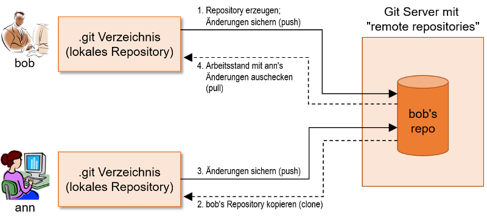

# Informatikwerkstatt
__Git & Github__

<!-- ggf Social Cars Git Folien nutzen -->

Note:  Zwei Studierende auffordern,  Protokoll zu der Veranstaltung heute zu führen; Headlines und 1-2 Stichworte für die Folie mitschreiben. (Wichtig ist, dass die Protokolle nicht identisch sind)

---

## Versionskontrolle - Was ist das?

* Software-Entwicklung ist heute _Teamwork_
* Software-Projekte laufen je nach Produkt über mehr als 10 Jahre
* Hohe Komplexität mit der Entwicklungszeit
* nicht-lineare Entwicklung (Patches, Releases, Hotfixes)

&rarr; Wie behält man da die Übersicht?<br/>
&rarr; Wie verwaltet man diese verschiedenen Entwicklungsstände?<br/>
&rarr; Wie vermeidet man, dass Entwickler sich gegenseitig stören?

> &rArr; Protokolliert zeitliche Änderungen um Veränderung nachvollziehen zu können

---

## Repositories

> Verzeichnisorientierte Struktur, die zur Verwaltung der Quellcodes mit zusätzlichen zeitlichen und Benutzerinformationen versieht. Zusätzlich werden verschiedene Tools zur Verwaltung berwendet

---

## Was ist Git?

* Dezentral organisiertes System zur [Versionsverwaltung](https://de.wikipedia.org/wiki/Versionsverwaltung)
* Entstanden 2005 aus der Linux Entwickler-Community
* Gut geeignet für große Projekte mit nicht-linearer Entwicklung

===

### Funktionsweise

* Versionshistorie: Reihe von _Snapshots_ über Dateien eines Projekts
* Bei jedem Speichern legt Git eine Version des Projekts an
    * Sichert Zustand sämtlicher Dateien (= Snapshot)
    * Speichert eine Referenz auf diesen Snapshot


===

### Workflow

* Drei Zustände einer Datei: geändert &rarr; vorgemerkt &rarr; committed! 
* Im _Arbeitsverzeichnis_  werden die Dateien bearbeitet
* Im _Staging-Bereich_ werden Änderungen vorgemerkt, die in die nächste Version übernommen werden sollen
* Das _Repository_ enthält ein komplettes Abbild des Projekts


---

## Gitconfig

- Nach der Installation von Git, sollte Name und E-Mail Adresse hinterlegt werden
  - Git baut diese Informationen in jeden Commit ein
  - Besonders wichtig beim Einsatz von Plattformen wie Github
  - Durch die `--global` Option werden die Eingaben für alle Repositorys übernommen
      
    ```
    git config --global user.name "John Doe"
    git config --global user.email johndoe.example.com
    ```

- `git config color.ui true` ermöglicht eine farbige Konsolenausgabe
- `git config --list` oder `git config {key}` zum Überpüfen der Einstellungen

---

## Clone

- Ermöglicht eine lokale Kopie eines existierenden Remote-Repositorys
- `git clone [url]` lädt jede einzelne Version jeder Datei in der Historie des Repositorys herunter
- Lokale Kopie befindet sich dann im aktuell ausgewählten Verzeichnis
- Vorgänge während des clone-Vorgangs:
  - Anlegung eines Verzeichnises
  - Initialisierung eines *.git* Verzeichnises (`git init`)
  - Download aller Dateien
  - Checkout einer Arbeitskopie der aktuellen Version

[Dokumentation](https://services.github.com/on-demand/github-cli/clone-repo-cli)

---

## Änderungen nachverfolgen

[Git Dokumentation](https://git-scm.com/book/de/v1/Git-Grundlagen-%C3%84nderungen-am-Repository-nachverfolgen)

===

### Änderungen vormerken - Git Add

<!-- git add, commit und Commit Nachrichten erklären -->
- `git add {Dateiname}` um Dateien für den nächsten Commit vorzumerken
  - Verschiebt die Dateien vom Arbeitsverzeichnis in den Staging-Bereich
  - `git add README` um eine bestimmte Datei vorzumerken
  - `git add *.java` um mehrere Dateien eines Typs vorzumerken
  - **Achtung**: Die Dateien sind noch nicht versioniert
- `git status` listet alle Dateien auf, die sich im Staging-Bereich befinden

===

### Änderung festschreiben - Git Commit

- `git commit` um die Dateien dauerhaft zu versionieren
  - Änderungen die nicht mit `git add` vorgemerkt wurden, werden nicht nicht committed
  - Nach Eingabe des Befehls öffnet sich ein Text-Editor:

  ```
  # Please enter the commit message for your changes. Lines starting
  # with '#' will be ignored, and an empty message aborts the commit.
  #
  # On branch master
  #
  # Initial commit
  #
  # Changes to be committed:
  #       new file:   helloworld.java
  ```

    - In dieses Fenster schreibt man seine Commit-Nachricht

- Mit `git commit -m "faster commit"` kann man sich diesen Schritt sparen
- Git liefert nach Abschluss einige Details über den Commit:
```
[master 7d1739e] faster commit
1 file changed, 1 insertion(+)
```

===

### Commit Nachrichten

- Sie soll möglichst genau beschreiben, welche Änderungen der Entwickler durchgeführt hat
  - Besonders wichtig wenn mehrere Entwickler gleichzeitig an etwas arbeiten
  - Commit Nachrichten stellen also eine Art "Kommunikationsmittel" dar.
- **Ziel**: Änderungen möglichst kurz aber trotzdem präzise zu beschreiben um anderen Leuten einen Überblick über gemachte Änderungen zu geben
- [Tipps für eine gute Commit-Nachricht](https://wp-typ.de/entwicklung/gute-git-commits-schreiben/)

===

### Git verteilte Architektur

* I.d.R.: zusätzliches "remote" Repository, von dem verschiedene Nutzer Ihre Daten kopieren ("klonen") und miteinander synchronisieren  
* Folgende Abbildung zeigt einen Beispiel-Workflow
* In der Folge schauen wir uns die bisher im Überblick gezeigten Abläufe im Detail an



===

## Push & Pull

### Push

- `git push {remote}{branch}` Verschiebt Commits vom lokalen Repository zum remote Repository
  - z.B. `git push origin master` Verschiebt alle austehenden Commits vom lokalen master-Branch in den remote master-Branch (origin)
  - es werden alle notwendigen Commits und internen Objekte (Dateien) übertragen

[Dokumentation](https://help.github.com/articles/pushing-to-a-remote/)

===

### Pull

- `git pull` bringt dein lokales Repository auf den Stand des remote Repositorys
- Verbindet zwei Funktionen:
  - **fetch** : Lädt Änderungen herunter
  - **merge** : Fügt remote Änderungen mit lokalen Änderungen zusammen
- Da bei pull immer ein **merge** Prozess stattfindet, kann es hierbei zu Konflikten kommen

[Dokumentation](https://help.github.com/articles/fetching-a-remote/)

---

### Änderungen überprüfen

- `git diff` ermöglicht eine exakte Auflistung aller Änderungen
  - Zeigt exakt an, welche Zeilen hinzugefügt, geändert oder entfernt wurden
  - Zeigt an, welche Änderungen noch nicht gestaged wurden
- `git diff --staged` zeigt alle Änderungen in der Staging Area an

- `git log` zeigt die bisherige Commit-Historie an
  - `git log -p -2` liefert eine Übersicht über alle Änderungen eines Commits (ähnlich `git diff`)
- `git log --stat` liefert eine Statistik
  - welche Dateien wurden geändert
  - wieviele Zeilen wurden hinzugefügt oder entfernt

---  

### Gitignore

- Viele Dateien (Cache Dateien, Logs, etc.) sind unnötig zu versionieren
- In der *.gitignore* Datei kann man festlegen welche Dateien oder Dateimuster von Git ignoriert werden sollen

    ```
    *.log (ignoriert alle Dateien mit der Endung *.log*)
    test.txt (ignoriert die test.txt-Datei)
    ```

- [Dokumentation](https://help.github.com/articles/ignoring-files/)
- [Vorlagen](https://github.com/github/gitignore)

===

### @Profi

**Tipp**: ignoriere zunächst einmal alle Dateien ` *.*` und füge dann konkret die benötigten Dateien und Dateimuster hinzu:

```
*.* (ignoriert alle Dateien)
!*.md
!.gitignore
!pom.xml
!*.java

# ignoring everything in java build
target/**
bin/**
```

---

## @Let's try

<!-- Philipps Beispiel einfügen -->

---

## Branches

- Ein Branch ist eine abgetrennte / isolierte Umgebung, deren Änderungen keine Auswirkungen auf den Master Code haben
  - Ermöglicht parallele Entwicklung an verschiedenen Features während der "Master"-Code unberührt bleibt
  - Raum zum experimentieren
  - **master**-Branch ist der lokale Standard Branch
- `git checkout -b featureX` erstellt einen neuen lokalen Branch mit dem Namen *featureX*
- `git checkout {branch}` wechselt in den angegebenen Branch

[Git Dokumentation](https://git-scm.com/book/de/v1/Git-Branching-Einfaches-Branching-und-Merging)
[Github Flow](https://guides.github.com/introduction/flow/)

Note: Verweisen auf die zwei Protokollanten

---

## @Let's try

<!-- Branch lokal erstellen, zwischen Branches wechseln -->

---

## Was ist Github?

- Bekannteste Open Source Plattform
- Größte Code-Hosting Plattform
  - Bereitstellung von Remote Repositorys
- **Social Coding**
  - Zusammen Software entwickeln (Open Source)
  - Pull-Requests
  - Einfaches Projektmanagement (Issues, Project-Boards)

---

## Github Account

1. [Registrieren](https://github.com/)
2. [Probleme?](https://services.github.com/on-demand/intro-to-github/create-github-account)
3. @Profi: [Github Student Pack](https://github.com/) Unendlich private Repositorys und andere Developer Tools kostenlos.

===

### SSH - Was hä?

SSH-Keys ermöglichen eine Verbindung zu GitHub, ohne Eingabe von username und password.

SSH-Key generieren:
- `ls -al ~/.ssh` prüft, ob SSH-Keys existieren
- `ssh-keygen -t rsa -b 4096 -C "Your E-Mail"` generiert einen neuen Key
  - Default location: `/c/Users/**Nutzer**/.ssh/id_rsa`
- `eval $(ssh-agent -s)` überprüft, ob der SSH-Agent-Prozess aktiv ist
- `ssh-add ~/.ssh/id_rsa` fügt den Key zum SSH-Agent hinzu

===

### SSH-Key & Github

- `clip < ~/.ssh/id_rsa.pub` Kopiert den Key in die Zwischenablage
- Auf Github unter **Settings**, **SSH and GPG keys** befindet sich **New SSH Key**
    - Unter Key den kopierten Key einfügen
    - Anschließend einen Titel geben der zum Gerät passt

===

### SSH Verbindung testen

- `ssh -T git@github.com` Versucht eine SSH-Verbindung zu Github aufzubauen
  - Warnungen mit einem **yes** bestätigen
- Befehl sollte folgende Ausgabe liefern:
- [Probleme?](https://help.github.com/articles/connecting-to-github-with-ssh/)

```
Hi **username**! You've successfully authenticated, but GitHub does not provide shell access.
```

---

## Projekt & Repository

- **Public** Repos sind einsehbar für alle Github Nutzer (Open Source)
- **Private** Repos sind nur für dich bzw. den Leuten denen du Zugriff erteilst einsehbar
- In jedem Repo sollten ein *README* und eine *.gitignore* Datei vorhanden sein
- [Dokumentation](https://help.github.com/articles/creating-a-new-repository/)
- [Lokales Repository auf Github importieren](https://help.github.com/articles/importing-a-repository-with-github-importer/)

===

### Local & Remote

<!-- was bedeutet local / remote Repository -->

---

## @Let's try

<!-- einmal erzeugt jeder in seinem eigenen Account ein Repo und pusht das vorhin erstellte Repo dorthin-->

---

## @Let's try

<!-- lokalen Branch erstellen, remote pushen, lokal pullen -->

---

## Merge Conflict

Note: Fragen, wie beide Protokolle gemergt werden sollen

- Beim Ändern von Code an denselben Stellen in den selben Dateien unterschiedlicher Branches, tritt bei einem Merge ein Fehler auf (Git kann Änderungen nicht mehr sauber zusammen führen)
- Beim Auftreten eines solchen Fehlers wird der Merge sofort gestoppt
- Fehler muss **manuell** behoben werden
  - Git fügt den betroffenen Dateien Konfliktlösungsmarker hinzu
  - Nach manueller Beseitigung müssen alle betroffenen Dateien wieder per `git add` markiert werden
  - `git commit` ausführen, um den Merge-Commit endgültig abzuschließen

[Dokumentation](https://help.github.com/articles/resolving-a-merge-conflict-using-the-command-line/)

---

## @Let's try

<!-- wir stellen ein Repository in der Infowerkstatt zur Verfügung, in dem Repo ist eine Textdatei mit Namen, jeder clont es sich und trägt seinen Namen ein und pusht es wieder und behebt ggf den Merge Conflict -->

---

## Issue

<!-- was sind Issues, wozu dienen sie -->
- Issues sind eine Möglichkeit um Aufgaben, Verbesserungen oder Bugs zu erfassen
- Issues können bestimmten Personen zugeordnet werden (Aufgabenverteilung)
- Mithilfe von Labels werdeb Issues kategorisiert / organisiertes

[Dokumentation](https://guides.github.com/features/issues/)

---

## @Profi - Milestones

- Sammlung von Issues
- Zuordnung von mehreren Issues zu einem spezifischen Feature oder Projekt-Phase
  - Bsp. Beta-Launch, May-Sprint oder UI-Design
  
---

## @Let's try

<!-- jeder erstellt in unserem Testrepo einen Issue und wenn alle Issue da sind, dann bündeln wir diese zu Milestones -->

---

## Die Handschrift - Styleguide

<!-- was ist ein Styleguide und ein Beispiel von einem unorganisierten Code, siehe Matsim, Jason o.ä.-->

---

## @Home

* [Git Bash](https://git-scm.com/downloads)
* [Github Desktop](https://desktop.github.com/)
* [Git Kraken](https://www.gitkraken.com/)

---

## Links

* Online Buch: [Pro Git](https://git-scm.com/book/de/v1) von Scott Chacon and Ben Straub
