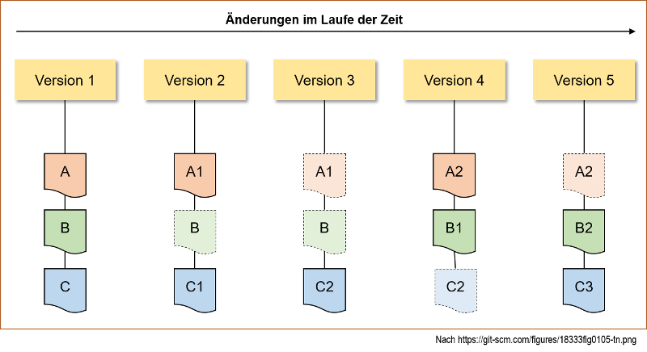
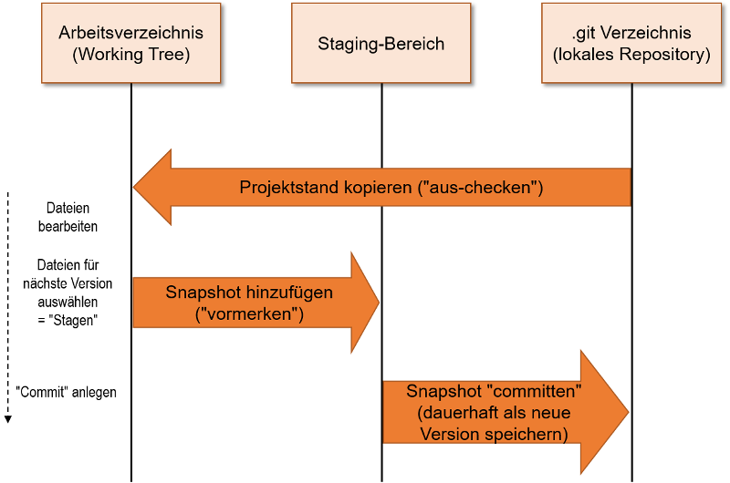
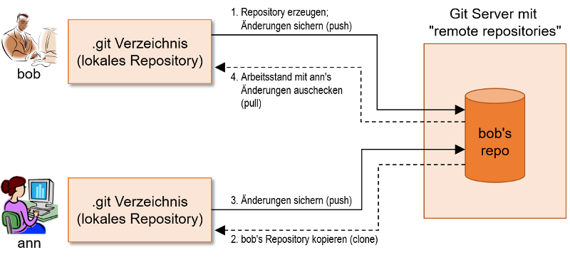

# Informatikwerkstatt
__Git & Github__

<!-- ggf Social Cars Git Folien nutzen -->

Note:  Zwei Studierende auffordern,  Protokoll zu der Veranstaltung heute zu führen; Headlines und 1-2 Stichworte für die Folie mitschreiben. (Wichtig ist, dass die Protokolle nicht identisch sind)

---

## Versionskontrolle - Was ist das und wofür?

* Komplexe Projekte, z.B. Softwareentwicklung, erfordern Zusammenarbeit zwischen vielen Beteiligten
  * Lange Entwicklungszeiten, viele Code-Module und Dokumente
  * Mehrere Entwickler und Teams arbeiten gleichzeitig
  * Nicht-lineare Entwicklung: Viele Unterversionen und Verzweigungen
* Wie behält man da die Übersicht? 
* Wie verwaltet man unterschiedliche Versionen und Entwicklungsstände?
* Wie vermeidet man, dass Entwickler sich gegenseitig stören?

&rarr; __Versionskontrollsystem__: Protokolliert Änderungen an Dateien über die Zeit hinweg, so dass man zu jedem Zeitpunkt auf Versionen und Änderungen zugreifen kann

---

## Repositories

<!-- Was ist ein Repository, wofür braucht man es, was ist der Sinn davon -->
* Systeme zur Versionskontrolle nutzen __Repositories__
* = Verwaltetes Verzeichnis zur Speicherung und Beschreibung digitaler Objekte (z.B. Source Code, Dokumentation, ...)
* = Eine Art Datenbank, auf der mehrere Nutzer parallel arbeiten können
* Realisiert Softwarefunktionen zur Versionskontrolle und Zusammenarbeit
* Für jedes digitale Objekt wird die Versionshistorie gespeichert

---

## Was ist Git?

<!-- einmal allgemeines zu Git -->
* Dezentral organisiertes System zur Versionskontrolle
* Entstanden aus der Linux Entwickler-Community
* Schnell, einfaches Design
* Speziell geeignet für große Projekte mit nichtlinearer Entwicklung

===

### Git Funktionsweise

* Versionshistorie: Reihe von "Snapshots" über Dateien eines Projekts
* Bei jedem Speichern legt Git eine Version des Projekts an 
    * Sichert Zustand sämtlicher Dateien in diesem Moment (= Snapshot) 
    * Speichert eine Referenz auf diesen Snapshot 
* Beispiel: Projekt mit drei initialen Dateien A, B und C

=== 

### Git lokale Sicht

* Jeder Nutzer hat lokal
    * Arbeitsverzeichnis: Hier werden die Dateien bearbeitet
    * Staging-Bereich: Hier werden Änderungen vorgemerkt, die in die nächste Version übernommen werden sollen 
    * Git Repository: Enthält komplettes Abbild eines Projekts
* Grundlegender lokaler Workflow:

* Drei Zustände einer Datei in Git: geändert, vorgemerkt, committed!

===

### Git verteilte Architektur

* I.d.R.: zusätzliches "remote" Repository, von dem verschiedene Nutzer Ihre Daten kopieren ("klonen") und miteinander synchronisieren  
* Folgende Abbildung zeigt einen Beispiel-Workflow

* In der Folge schauen wir uns die bisher im Überblick gezeigten Abläufe im Detail an

---

## Gitconfig

<!-- wie konfiguriert man git -->

---

## Wie initialisiere ich Repository?

<!-- git init erklären -->

---

## Änderungen merken - Git Add & Commit

<!-- git add, commit und Commit Nachrichten erklären -->

===

### Gitignore

<!-- Dateien ignorieren -->

---

## @Let's try

<!-- einmal ein komplettes Repository erstellen lassen und initial etwas committen -->

---

## Branches

<!-- was sind Branches, wofür sind sie gut, wie werden sie erstellt -->

Note: Verweisen auf die zwei Protokollanten

---

## @Let's try

<!-- Branch lokal erstellen, zwischen Branches wechseln -->

---

## Was ist Github?

<!-- was ist Github (Social Coding) -->

---

## Github Account

<!-- Account anlegen -->

===

### SSH - Was hä?

<!-- ssh-keygen einmal erläutern -->

---

## Projekt & Repository

<!-- wie legt man bei Github ein eigenes Projekt / Repository an -->

===

### Local & Remote

<!-- was bedeutet local / remote Repository -->

---

## Clone

<!-- wie holt man sich ein Repository -->

---

## @Profi - Clone Recursive

<!-- Submodule kurz anreißen und dazu rekursives Clonen erläutern und einmal den Befehlssyntax zeigen -->

---

## Push & Pull

<!-- wie wird ein locales mit einem remote Repository synchronisiert -->

---

## @Let's try

<!-- einmal erzeugt jeder in seinem eigenen Account ein Repo und pusht das vorhin erstellte Repo dorthin-->

---

## Branches

<!-- Branches bei Github, lokal / remote Verbindung -->

---

## @Let's try

<!-- lokalen Branch erstellen, remote pushen, lokal pullen -->

---

## Merge Conflict

<!-- was ist ein Merge Conflict -->

Note: Fragen, wie beide Protokolle gemergt werden sollen

---

## @Let's try

<!-- wir stellen ein Repository in der Infowerkstatt zur Verfügung, in dem Repo ist eine Textdatei mit Namen, jeder clont es sich und trägt seinen Namen ein und pusht es wieder und behebt ggf den Merge Conflict -->

---

## Milestones

<!-- was sind Milestones, wozu dienen sie -->

---

## Issue

<!-- was sind Issues, wozu dienen sie -->

---

## @Let's try

<!-- jeder erstellt in unserem Testrepo einen Issue und wenn alle Issue da sind, dann bündeln wir diese zu Milestones -->

---

## Die Handschrift - Styleguide

<!-- was ist ein Styleguide und ein Beispiel von einem unorganisierten Code, siehe Matsim, Jason o.ä.-->

===

### Notationen / Styleguides

<!-- fertige Styleguides / Notationen kurz erläutern -->

* [Ungarische Notation](https://de.wikipedia.org/wiki/Ungarische_Notation)
* [Google Java Style Guide](https://google.github.io/styleguide/javaguide.html)

===

### How-to write

<!-- Beispiel aus dem Bachelorprojekt / LightJason wie mein Code aufgebaut ist, Mixtur aus ungarischer Notation mit Google Styleguide -->

---

## @Home

* [Git Bash](https://git-scm.com/downloads)
* [Git Kraken](https://www.gitkraken.com/)

---

## Links

* Online Buch: [Pro Git](https://git-scm.com/book/de/v1) von Scott Chacon and Ben Straub
