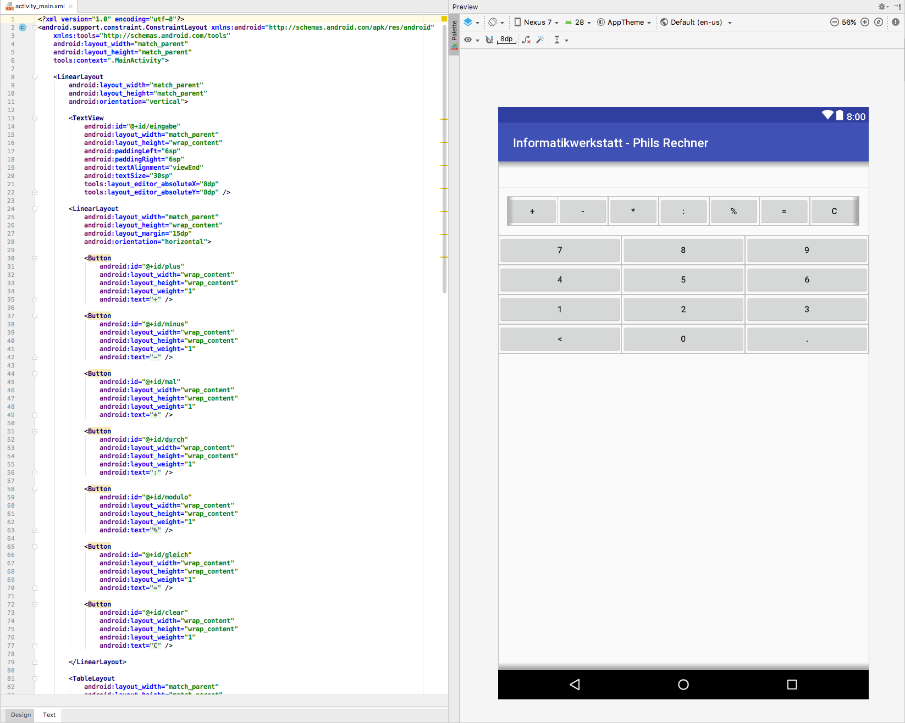

# Informatikwerkstatt
__User Interface__

---

## Unser Szenario - Der Taschenrechner

> Wir bauen einen Taschenrechner, der Plus, Minus, Mal und Geteilt kann (Klammersetzung und Punkt-vor-Strichrechnung ignorieren wir). Wer möchte kann auch noch eine Rest-Division (Modulo) einbauen

* Komma-Zahlen sollen eingebar sein
* Rückgängigtaste für die aktuelle Eingabe soll vorhanden sein
* Berechnung soll korrekt funktionieren

<small>Eine [Beispiel APK](https://github.com/Informatikwerkstatt/informatikwerkstatt.github.io/releases/download/apk-taschenrechner/taschenrechner.apk) gibt es zum anschauen</small>

Note: Studis fragen, was man dafür wohl alles braucht: UI Layout, Events, Algorithmus

---

## Interface Aufbau

> Ein [einfaches User-Interface](https://developer.android.com/training/basics/firstapp/building-ui) (UI) wird im besten Fall mit Containern erstellt und man ordnet diese Container einmal immer relativ zu dem übergeordneten Container an. Je nach Design kann somit direkt ein Hoch- oder Querlayout erzeugt werden.
> 
===

### View

> Ein [View](https://developer.android.com/reference/android/view/View) ist die oberste Ebene für graphische Layouts. Die _Activity_ ist ein Container der ein Layout enthält. Ein guter Vergleich ist eine Festplatte unter Windows, der _Laufwerksbuchstabe_ ist die _Activity_, das _Verzeichnis_ die [Viewgroup](#/2/2), die _Datei_ der _View_ und der _Dateiinhalt_ das _konkrete Layout_ des Elements. 

===

### ViewGroup

> Eine [ViewGroup](https://developer.android.com/reference/android/view/ViewGroup) ist eine Sammlung von View-Containern eines Layouts, sowohl View wie auch weitere ViewGroup können miteinander verbunden werden


---

## Alles im Lot - Layouts

> Wir behandeln hier nur die Grundfunktionalität wie ein Layout erstellt, die Details für komplexere Layouts müssen je nach Aufgabe dann selbst entwickelt werden. Ein gutes Design erhält man durch Kreativität und Feedback, als Hilfestellung gibt es häufig [Design Styleguides](https://material.io/).

===

### Constraint Layout

[Constraint Layouts](https://developer.android.com/training/constraint-layout/) sind aktuell die Wahl für ein Layout, der Vorteil besteht darin, dass sie sich recht flexibel an verschiedene Displaygröße, sowie horizontale / vertikale Darstellung anpassen lassen. Man baut gedanklich eine große Box, in die man viele kleinere Boxen stellt auf. Damit ergibt sich die Layouthierarchie des [Component Trees](#/5)

<small>Wer Erfahrung mit Webseitengestelltung kennt vielleicht den Begriff [Responsive Webdesign](https://de.wikipedia.org/wiki/Responsive_Webdesign), um das Layout der Webseite an die Auflösung des Endgerätes anzupassen. Das Design einer App kann in ähnliche organisiert werden</small>

===

### Linear Layout

Das [Linear Layout](https://developer.android.com/guide/topics/ui/layout/linear) ermöglicht es geradlinige Strukturen wie z.B. Listen darzustellen. Die Breite ist flexible, aber auf eine Spalte begrenzt, und die Höhe orientiert sich der Länge des Inhaltes


===

### Grid View

Das [Grid View Layout](https://developer.android.com/guide/topics/ui/layout/gridview) ist aufgebaut wie ein Schachbrett, sollen aber nicht mehr verwendet werden. __Anmerkung aus der Dokumentation:__ _For better performance and tooling support, you should instead build your layout with Constraint Layout._


===

### Relative Layout

> Relative Layouts sind _zurzeit_ die einfachste Möglichkeit um sehr gut strukturierte und flexible Layouts zu erzeugen. Der Kniff besteht dadurch, dass man die einzelnen Layout Elemente (Hierarchien) immer in Relation zu dem Parent-Element setzt. Somit richtet sich ein Kindelement immer nach dem Vaterelement aus

===

### Tutorial Relative Layout

<iframe class="video" src="https://www.youtube.com/embed/CW7M_akbp64?rel=0" frameborder="0" webkitallowfullscreen mozallowfullscreen allowfullscreen />

---

## Was bin ich? - Layoutelemente

<div class="flex">
<div>
UI's werden mit Hilfe einzelner Layoutelemente, eine kurze Übersicht über die verschiedenen Elemente. Alle Elemente sind in einer dreigliedigen Ansicht angeordet ([Palette & Component Tree](#/4), aktuelles Layout, Elementattribute)<br/>
<ul>
<li>Button</li>
<li>Textfield</li>
<li>Layouts</li>
</ul>
</div>
<div>

</div>
</div>

<!-- https://developer.android.com/training/keyboard-input/style -->

===

### Toast

> [Toast Notifiers](https://developer.android.com/guide/topics/ui/notifiers/toasts) sind kleine Textboxen, die über der App eingeblendet werden und nach ein paar Sekunden wieder automatisch verschwinden. Der Aufruf, um eine solche Box zu erzeugen, benötigt den Applikation-Context (diesen erhält man aus der Activity), damit die Box über allen anderen Fenstern angezeigt wird, die Nachricht und dann die Zeit, wie lange sie angezeigt werden soll

```java
Toast.makeText( 
    activity.getApplicationContext(), 
    "eine Hallo-Nachricht", 
    Toast.LENGTH_LONG | Toast.LENGTH_SHORT 
).show();
``` 

===

### Dialog

> [Dialoge](https://developer.android.com/guide/topics/ui/dialogs) sind _kleine Fenster_ um mit dem Nutzer zu interagieren. Wichtig bei Dialogen ist die Eigenschaft [modal / nicht-modal](https://de.wikipedia.org/wiki/Dialog_%28Benutzeroberfl%C3%A4che%29#Modale_und_nichtmodale_Dialoge). Modal bedeutet blockierend, d.h. so lange der Dialog offen ist, wartet die Anwendung auf die Eingabe. Ein gutes [Design](https://material.io/design/components/dialogs.html#behavior) hilft dem Nutzer


---

## Palette & Component Tree

<div class="flex">
<div>
<p>
Zum Design des Layouts findet sich auf der linken Seite die _Palette_, die die verschiedenen Elemente enthält. Man zieht die einzelnen Elemente aus der Palette
an die Stelle im Layout, wo sie erscheinen sollen.
</p>
<p>Der _Component Tree_ die die aktuelle Struktur des Layouts, hiermit sieht die [Hierarchie](#/2/2) des Layoutes, also welches Element _hängt unter_ welchem Container.</p>
</div>
<div>

</div>
</div>

---

## Elementattribute

<div class="flex">
<div>
Über den Text ```View all attributes &rlarr;```  kann die Deatilsicht zu einem Attribut aufgerufen werden. Insbesondere Eigenschaften zum Layout, wie Abstände, Schrift, Farben etc. werden darüber eingestellt
</div>
<div>

</div>
</div>

===

### Margin & Padding

===

### Interne Darstellung

<div class="flex">
<div>
Die UI wird intern als [XML](https://de.wikipedia.org/wiki/Extensible_Markup_Language) Struktur beschrieben. Man schaltet zwischen XML und Design Darstellung mit den beiden Tabs ```Design``` und ```Text``` am unteren Rand um. Es ist hilfreich sich mit der [XML Struktur](https://developer.android.com/guide/topics/resources/layout-resource) für die Desigbeschreibung auseinander zu setzen, da manche Einstellungen nur so zugänglich sind
</div>
<div>

</div>
</div>

---

## Die Verbindung - Adapter

<!-- 
https://developer.android.com/reference/android/widget/Adapter
https://www.edureka.co/blog/what-are-adapters-in-android/
https://code.tutsplus.com/tutorials/android-from-scratch-understanding-adapters-and-adapter-views--cms-26646
-->

---

## Struktur verleihen - Trick & Kniffe

<!-- 
https://developer.android.com/design/

https://android-developers.googleblog.com/2011/09/thinking-like-web-designer.html

https://android-developers.googleblog.com/2009/02/android-layout-tricks-1.html 
https://android-developers.googleblog.com/2009/03/android-layout-tricks-3-optimize-by.html
https://android-developers.googleblog.com/2009/03/android-layout-tricks-3-optimize-with.html
https://developer.android.com/training/improving-layouts/optimizing-layout
-->

---

## @Let's try

<!-- Ein paar Buttons, bei denen ein Dialog, Toast erscheint und ein Text aus einem Editorfeld eingelesen und in etwas anderes eingesetzt wird -->

---

## Recycling von Layout - Fragments

<!-- https://android-developers.googleblog.com/2009/02/android-layout-tricks-2-reusing-layouts.html -->

---

## Fragmente Lifetime

---

## Dynamische Oberflächen

---

## @Profis

* [App Widget](https://developer.android.com/guide/topics/appwidgets/)
* [App Bar](https://developer.android.com/training/appbar/)
